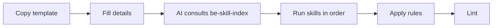
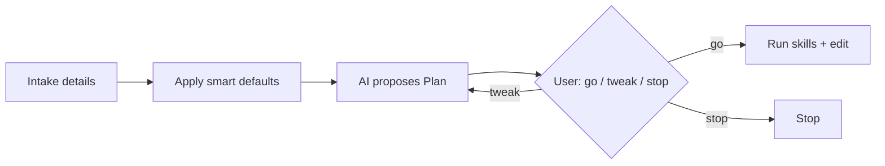

# New Requirement Intake (core-be)

**Use this format when giving a new requirement.** Providing the details below in your request helps the AI perform best and ensures the right skills and rules are invoked.

---

## Intake flow

1. **You (the user)** describe the requirement using the **Details to provide** for the matching type below (omit fields covered by **Default assumptions**).
2. **The AI** applies defaults, proposes a **Plan** once (see [Plan confirmation](#plan-confirmation-ai-workflow)), then runs skills after you reply **go**.
3. **The AI** consults **`.cursor/skills/be-skill-index/SKILL.md`** first, invokes the **Skills to run** in order, applies the **Rules** that match the changed files, and fixes lint issues in touched files (**be-code-smells-and-best-practices**) before finishing.

---

## Default assumptions (when you don't specify)

The AI fills these unless your message says otherwise. List overrides in your first message (e.g. "public list endpoint", "no soft-delete").

| Area | Default |
| ---- | ------- |
| **Access** | `authenticated` (use `public` only for auth flows, webhooks, health, or explicit public API) |
| **Pagination** | Cursor-based (`PAGINATION.DEFAULT_LIMIT`) on list routes |
| **Soft-delete** | ON for tenant-owned resources; OFF for system tables, audit, immutable billing ledgers |
| **Tenancy** | Scoped by the signed `org` claim / organization context unless marked global |
| **Tests** | Sub-domain unit tests + bundled domain e2e in `src/domains/<domain>/__tests__/<domain>.test.ts` |
| **i18n** | All user-facing strings use translation keys (`errors.*`, `success.*`) |
| **Logging** | `logger` from `@/shared/utils/infrastructure/logger.util.js`; no `console.log` |
| **Object params** | Single options object for 2+ inputs (repository methods keep positional params) |
| **Validation** | Zod DTO in `*.dto.ts` + function validator with `.safeParse()` in `*.validator.ts` |
| **API version** | `/api/v1` prefix for public HTTP routes |
| **Target branch** | Feature work merges to `main` |
| **In-source docs** | TSDoc on every public export, `@remarks` on services / workers / processors / policy files, hand-written `<folder>.overview.md` for new folders, `schema: { summary, description, tags }` on every Fastify route, `pnpm tsdoc:check` must pass |

---

## Full-slice template — one requirement → production-ready slice

Fill this once and run **`/be-build-requirement`** (or paste it as your prompt). The AI validates it for completeness (missing fields are surfaced, never guessed), then drives the full build chain to a gate-passing vertical slice and emits a **reports bundle**. This is the autonomous path; the type-by-type sections below remain the detailed reference.

### Template

The canonical form is **[`requirement.template.md`](requirement.template.md)** (filled example: **[`requirement.example.md`](requirement.example.md)**). You don't have to fill it — give **`/be-build-requirement`** a direct task and it drafts the full 9-section document (data model, API, logic, i18n, seed, tests [unit/integration/e2e/smoke/contract/chaos], non-functionals, and a **section-9 file tree**) for your review, asks about anything it shouldn't guess, and iterates before building. Or fill the form yourself; keep the `## N.` headings as-is and mark anything N/A as `none`.

### What `/be-build-requirement` does

It runs the pipeline (each step is an existing skill), self-healing failed gates and escalating only on genuine ambiguity:

`schema-complete` → **be-domain-generator** (repository → service → controller → dto/validator/serializer/types → container + route registration) → `route-complete` → **be-workers-events** (if events) → **be-seed-maintainer** → **be-test-generator** → i18n + **be-tsdoc-export-guard** + **be-overview-doc-maintainer** + OpenAPI → **/be-pre-merge-review**.

**Definition of done:** `pnpm validate` + the route/domain gates + a live `pnpm verify:base` smoke + `/be-pre-merge-review` clean. It emits a **reports bundle** under `docs/builds/<date>-<feature>/`: build report (files, decisions, assumptions, deviations), a requirement→code→test traceability matrix, the review report, and a quality/security summary.

---

## Requirement types and details to provide

### 1. New domain or sub-domain (new resource/API surface)

**Details to provide:**

- **Domain** (must match an existing DB schema): `auth` | `user` | `tenancy` | `billing` | `notify` | `audit` | `upload`
- **Sub-domain name** (domain-prefixed, e.g. `organization-settings`, `member-invitation`): **\*\***\_**\*\***
- **Parent sub-domain** (if nested aggregate child): e.g. `organization` → `organization-api-key`, `webhook` → `webhook-event` — path is `sub-domains/<parent>/<child>/`
- **API shape**: list (GET), get-by-id (GET :id), create (POST), update (PATCH :id), delete (DELETE :id), or custom (describe path + method + body/query)
- **Access**: `public` | `authenticated` | `org-permission:<code>` | `global-role:admin` (or list which routes need which)
- **Database**: Do you need new tables? If yes: table name(s), columns (name, type, constraints) in brief.
- **Dependencies**: Any cross-domain calls? (e.g. "create membership when invitation is accepted")

**Defaults:** Sub-domain folder name is domain-prefixed; REST shape (`GET` list, `GET :id`, `POST`, `PATCH :id`, `DELETE :id`) unless you specify custom routes; tenant tables include `id`, `public_id`, `organization_id` (when tenant-owned), `created_at`, `updated_at`, `deleted_at` when soft-delete applies; one bundled e2e suite at `__tests__/<domain>.test.ts`.

**Skills to run (in order):**

1. **be-domain-generator** — `.cursor/skills/be-domain-generator/SKILL.md`
2. **be-schema-generator** (if new tables) — `.cursor/skills/be-schema-generator/SKILL.md`
3. **be-sql-design-guard** — `.cursor/skills/be-sql-design-guard/SKILL.md`
4. **be-db-migration-maintainer** (if new tables) — `.cursor/skills/be-db-migration-maintainer/SKILL.md`
5. **be-workers-events** (if events/queues/workers) — `.cursor/skills/be-workers-events/SKILL.md`
6. **be-route-catalog** — `.cursor/skills/be-route-catalog/SKILL.md`
7. **be-route-schema-doc-guard** — `.cursor/skills/be-route-schema-doc-guard/SKILL.md`
8. **be-test-generator** — `.cursor/skills/be-test-generator/SKILL.md`
9. **be-seed-maintainer** (if seed data needed) — `.cursor/skills/be-seed-maintainer/SKILL.md`
10. **be-tsdoc-export-guard** — TSDoc on every public export added — `.cursor/skills/be-tsdoc-export-guard/SKILL.md`
11. **be-overview-doc-maintainer** — `<folder>.overview.md` for the new domain (Template A.1) and the new sub-domain (Template A.2) — `.cursor/skills/be-overview-doc-maintainer/SKILL.md`
12. **be-system-narrative-maintainer** (only when adding a new domain) — update Domains table in `src/OVERVIEW.md`; add patterns/flows entries if introduced — `.cursor/skills/be-system-narrative-maintainer/SKILL.md`
13. **be-structure-maintainer** — `.cursor/skills/be-structure-maintainer/SKILL.md`
14. **be-code-smells-and-best-practices** — zero new lint issues in touched files; run `pnpm tsdoc:check` to confirm coverage budget is not exceeded

**Rules that will apply:**  
`be-src-architecture.mdc`, `be-domain-generator-sync.mdc`, `be-sql-design-guard-sync.mdc`, `be-no-placeholder-files.mdc`, `be-code-smells-and-best-practices-sync.mdc`, `be-testing-conventions.mdc`

---

### 2. New routes only (existing domain/sub-domain)

**Details to provide:**

- **Domain + sub-domain** (e.g. `tenancy` / `organization`): **\*\***\_**\*\***
- **New routes**: for each — HTTP method, path (e.g. `GET /organizations/:id/settings`), request body/query shape (brief), response shape (brief), access (`public` | `authenticated` | `org-permission:...` | `global-role:...`)

**Defaults:** Extend existing sub-domain layers only (no new domain scaffold); list routes use cursor pagination; access `authenticated` unless you name a permission code.

**Skills to run (in order):**

1. **be-domain-generator** (for layout reference) or implement in existing controller/service/validator/serializer
2. **be-route-catalog** — `.cursor/skills/be-route-catalog/SKILL.md`
3. **be-route-schema-doc-guard** — `.cursor/skills/be-route-schema-doc-guard/SKILL.md`
4. **be-test-generator** (add tests for new routes)
5. **be-seed-maintainer** (if new routes need seed data)
6. **be-tsdoc-export-guard** — TSDoc on any new public exports introduced by the route work; run `pnpm tsdoc:check`
7. **be-code-smells-and-best-practices**

**Rules that will apply:**  
`be-src-architecture.mdc`, `be-domain-generator-sync.mdc`, `be-code-smells-and-best-practices-sync.mdc`, `be-testing-conventions.mdc`

---

### 3. New event / queue / worker (background job)

**Details to provide:**

- **Domain + sub-domain** (e.g. `notify` / `webhook`): **\*\***\_**\*\***
- **Event name** (if event-driven): **\*\***\_**\*\***
- **Queue name** (BullMQ): **\*\***\_**\*\***
- **Job payload**: list of fields (e.g. `{ webhookId, payload, attempt }`)
- **Worker behavior**: what the worker does (e.g. "HTTP POST to endpoint, retry 3x, update delivery_attempt")
- **Who enqueues**: which service/handler emits the event or calls `enqueue*`

**Defaults:** Processor lives under domain `workers/`; job payload includes `organizationPublicId` for tenant-scoped work; DLQ + retries per existing queue patterns; event-bus handlers must not fail the HTTP request.

**Skills to run (in order):**

1. **be-workers-events** — `.cursor/skills/be-workers-events/SKILL.md`
2. **be-route-catalog** + **be-route-schema-doc-guard** (if any new HTTP route triggers the job)
3. **be-test-generator** (if new routes or worker tests)
4. **be-tsdoc-export-guard** — TSDoc summary + `@remarks` on every new export in `*.worker.ts` / `*.processor.ts` / queue / event files
5. **be-overview-doc-maintainer** (if a new domain/sub-domain folder is introduced)
6. **be-system-narrative-maintainer** (if the worker introduces a new pattern or end-to-end flow)
7. **be-structure-maintainer** (if new dirs)
8. **be-code-smells-and-best-practices** — run `pnpm tsdoc:check` to confirm coverage budget

**Rules that will apply:**  
`be-src-architecture.mdc`, `be-workers-events-sync.mdc`, `be-code-smells-and-best-practices-sync.mdc`

---

### 4. New or changed database schema (tables/columns)

**Details to provide:**

- **Domain** (DB schema name): **\*\***\_**\*\***
- **Sub-domain** (if any): **\*\***\_**\*\***
- **Table name** (snake_case, plural): **\*\***\_**\*\***
- **Columns**: name, type (e.g. `text`, `bigint`, `timestamp with time zone`, `jsonb`), `notNull()`, `default()`, unique, FK to table.column. Use `text` everywhere — never `varchar(n)`; enforce real length/format limits with a `CHECK` constraint (see `be-sql-design-guard` section C).
- **Indexes**: which columns, unique or not
- **Migration**: "add new migration file" or "change existing table X"

**Defaults:** New migration file (forward-only in PR); `text` columns not `varchar(n)`; indexes for FKs and common filters; `IF NOT EXISTS` / safe DDL per **be-db-migration-maintainer**.

**Skills to run (in order):**

1. **be-schema-generator** — `.cursor/skills/be-schema-generator/SKILL.md`
2. **be-sql-design-guard** — `.cursor/skills/be-sql-design-guard/SKILL.md`
3. **be-db-migration-maintainer** — `.cursor/skills/be-db-migration-maintainer/SKILL.md`
4. **be-seed-maintainer** (if seed data for new tables)
5. **be-structure-maintainer** (if new schema file)
6. **be-code-smells-and-best-practices**

**Rules that will apply:**  
`be-src-architecture.mdc`, `be-sql-design-guard-sync.mdc`, `be-code-smells-and-best-practices-sync.mdc`

---

### 5. New seed data or change to seeds

**Details to provide:**

- **What to seed**: e.g. "default plan", "super_admin user", "sample organization"
- **Script**: `pnpm db:seed` (minimal) or `pnpm db:seed:full` (full demo)
- **Idempotency**: can the seed run multiple times? (prefer yes)

**Defaults:** Idempotent seeds; minimal script for reference data, full script for demo fixtures; align with [routes.txt](../routes.txt) exposed APIs.

**Skills to run (in order):**

1. **be-seed-maintainer** — `.cursor/skills/be-seed-maintainer/SKILL.md`
2. **be-code-smells-and-best-practices**

**Rules that will apply:**  
`be-code-smells-and-best-practices-sync.mdc`

---

### 6. Porting from Supabase Edge Functions (migration)

**Details to provide:**

- **Source**: path or description of the Supabase function(s) (e.g. `supabase/functions/_shared/...` or "auth callback")
- **Target domain/sub-domain** in core-be: **\*\***\_**\*\***
- **Routes to expose** (method, path, body, response)
- **Env/secrets**: list any Supabase-specific env vars and their core-be equivalent (e.g. `SUPABASE_URL` → `DATABASE_URL`)

**Defaults:** Target domain follows canonical layout; map Deno handlers to Fastify routes + services; use **be-env-schema-add** for any new env vars.

**Skills to run (in order):**

1. **be-supabase-porting** — `.cursor/skills/be-supabase-porting/SKILL.md`
2. **be-domain-generator** or extend existing domain
3. **be-route-catalog** + **be-openapi-route-sync**
4. **be-test-generator**
5. **be-structure-maintainer**
6. **be-code-smells-and-best-practices**

**Rules that will apply:**  
`be-src-architecture.mdc`, `be-domain-generator-sync.mdc`, `be-code-smells-and-best-practices-sync.mdc`, `be-testing-conventions.mdc`

---

### 7. ESLint / pre-commit / CI / security pipeline change

**Details to provide:**

- **What changes**: e.g. "add rule X", "run Semgrep in CI", "change audit level"
- **Files**: `biome.json`, `.husky/pre-commit`, `.github/workflows/pr-ci.yml`, `.github/workflows/post-merge-ci.yml`, `.gitleaks.toml`, `.semgrepignore`, etc.

**Defaults:** PR merge gate stays **pr-ci.yml** + **pr-governance.yml**; post-merge deploy/release stays **post-merge-ci.yml**; do not weaken required checks in rulesets.

**Skills to run (in order):**

1. **be-code-quality-guard** — `.cursor/skills/be-code-quality-guard/SKILL.md`
2. **be-code-smells-and-best-practices** (if code under `src/` is touched)

**Rules that will apply:**  
`be-code-quality-guard-sync.mdc`, `be-code-smells-and-best-practices-sync.mdc`

---

### 8. Middleware / infra / security / production hardening

**Details to provide:**

- **What**: e.g. "add rate limit for login", "enable RLS for table X", "circuit breaker for new client"
- **Where**: middleware, `connection.ts`, `env.config.ts`, etc.

**Defaults:** Follow existing middleware registration in `src/shared/middlewares/`; document operational impact in the matching runbook under `docs/deployment/runbooks/` or `docs/reference/security/`.

**Skills to run (in order):**

1. **be-production-hardening-guard** — `.cursor/skills/be-production-hardening-guard/SKILL.md`
2. **be-structure-maintainer** (if new files or layout)
3. **be-code-smells-and-best-practices**

**Rules that will apply:**  
`be-production-hardening.mdc`, `be-src-architecture.mdc`, `be-code-smells-and-best-practices-sync.mdc`

---

### 9. Rename / move files or folders (structure change)

**Details to provide:**

- **Current path(s)**: **\*\***\_**\*\***
- **New path(s)**: **\*\***\_**\*\***
- **Reason**: e.g. "align with domain naming", "split sub-domain"

**Defaults:** Mechanical rename with import path updates; sync **be-structure-maintainer** artifacts (CLAUDE.md, skills, rules) when layout docs change.

**Skills to run (in order):**

1. **be-structure-maintainer** — `.cursor/skills/be-structure-maintainer/SKILL.md`
2. **be-domain-generator** (if domain layout changes)
3. **be-route-catalog** (if route files move)
4. **be-code-smells-and-best-practices**

**Rules that will apply:**  
`be-structure-maintainer-sync.mdc`, `be-src-architecture.mdc`, `be-domain-generator-sync.mdc` (if routes), `be-code-smells-and-best-practices-sync.mdc`

---

### 10. PR babysit / fix CI on a pull request

**Details to provide:**

- **PR number or branch name**
- **Failing check name(s)** (if known)
- **Scope**: fix only this PR vs also merge latest base branch

**Defaults:** Apply [pr-review.md](../process/pr-review.md) rubric; merge/rebase base branch when behind; never weaken CI to go green.

**Skills to run (in order):**

1. **be-ci-investigator** (if diagnosing one check) — `.cursor/skills/be-ci-investigation/SKILL.md`
2. **be-pr-babysit** — `.cursor/skills/be-pr-babysit/SKILL.md`
3. **be-before-commit-guard** (if pre-commit fails locally)
4. Skills from **be-skill-index** matching the code you change (routes, migrations, contract/chaos tests, etc.)

---

### 11. Split work into multiple PRs

**Details to provide:**

- **Goal** of the overall work
- **Preferred split** (optional): by domain, migration-first, etc.
- **Whether stacking** is acceptable

**Defaults:** Smallest reviewable slices (schema → API → workers); each slice should pass `pnpm ci:quality` or full gate as appropriate.

**Skills to run:**

1. **be-split-to-prs** — `.cursor/skills/be-split-to-prs/SKILL.md`
2. Per-slice skills from **be-skill-index** after each PR is carved out

---

### 12. Other or mixed requirement

**Details to provide:**

- **Goal**: 1–2 sentences.
- **Scope**: which domains/files (e.g. "billing and tenancy", "only auth controller").
- **Acceptance**: how to verify (e.g. "GET /api/v1/billing/plans returns 200", "lint and tests pass").

**Defaults:** Infer requirement type from scope; apply global defaults above; run **be-skill-index** triggers for every file category touched.

**Skills to run:**

- **Always:** Consult **be-skill-index** first, then run any skill whose trigger matches your changes.
- **Always:** **be-code-smells-and-best-practices** after editing `src/**/*.ts` (fix touched files; pre-commit/CI run full validate).
- **If routes change:** **be-route-schema-doc-guard**, **be-route-catalog**, **be-openapi-multilingual** (new tags), **be-seed-maintainer**.
- **If domain/structure changes:** **be-structure-maintainer**, **be-domain-generator** (if new scaffold).

**Rules that will apply:**  
All `.cursor/rules/*.mdc` whose globs match the files you change (see skill index "Auto-trigger rules" table).

---

## Plan confirmation (AI workflow)

After you send a requirement, the AI proposes **one** plan before editing code. You should not get repeated clarification questions unless something is destructive.

### Plan contents (AI posts once)

1. **Requirement type** (1–12) and one-line goal.
2. **Fields** — what you provided vs what defaults apply.
3. **Skills** — ordered list from the matching section above.
4. **Files** — create/modify paths (domains, migrations, docs, workflows).
5. **Verification** — commands (e.g. `pnpm test`, `pnpm routes:catalog:check`, targeted domain test).

### Your reply

| Reply | Meaning |
| ----- | ------- |
| **go** | Proceed; no more questions unless a blocker below appears |
| **tweak …** | Adjust plan; AI revises plan once more if needed, then executes on next **go** |
| **stop** | Do not implement |

### When the AI may ask again (after **go**)

- Irreversible data loss or production-only secret handling.
- Breaking API contract without you acknowledging **Major** release.
- Ambiguous ownership between two domains with no default.

---

## Quick reference: all skills

| Skill                          | Path                                                     | When to invoke                                            |
| ------------------------------ | -------------------------------------------------------- | --------------------------------------------------------- |
| **be-skill-index**                | `.cursor/skills/be-skill-index/SKILL.md`                    | **First** — full catalog and triggers (45 project skills) |
| be-domain-generator               | `.cursor/skills/be-domain-generator/SKILL.md`               | New domain/sub-domain scaffold                            |
| be-route-catalog                  | `.cursor/skills/be-route-catalog/SKILL.md`                  | Any change to `*.routes.ts`                               |
| be-route-schema-doc-guard         | `.cursor/skills/be-route-schema-doc-guard/SKILL.md`         | Route `schema: { summary, description, tags }`          |
| be-workers-events                 | `.cursor/skills/be-workers-events/SKILL.md`                 | Events, queues, workers                                   |
| be-schema-generator               | `.cursor/skills/be-schema-generator/SKILL.md`               | New/changed Drizzle schema                                |
| be-sql-design-guard               | `.cursor/skills/be-sql-design-guard/SKILL.md`               | Schema design review                                      |
| be-db-migration-maintainer        | `.cursor/skills/be-db-migration-maintainer/SKILL.md`        | SQL in `migrations/`                                      |
| be-test-generator                 | `.cursor/skills/be-test-generator/SKILL.md`                 | Tests, validators, serializers                            |
| be-seed-maintainer                | `.cursor/skills/be-seed-maintainer/SKILL.md`                | Seed scripts or seed data                                 |
| be-structure-maintainer           | `.cursor/skills/be-structure-maintainer/SKILL.md`           | Renames, moves, layout sync                               |
| be-supabase-porting               | `.cursor/skills/be-supabase-porting/SKILL.md`               | Supabase Edge Functions → core-be (manual)                |
| be-code-quality-guard             | `.cursor/skills/be-code-quality-guard/SKILL.md`             | ESLint, Husky, CI security                                |
| be-production-hardening-guard     | `.cursor/skills/be-production-hardening-guard/SKILL.md`     | Middleware, infra, security                               |
| be-path-to-production-gate        | `.cursor/skills/be-path-to-production-gate/SKILL.md`        | Pre-release / deploy review                               |
| be-code-smells-and-best-practices | `.cursor/skills/be-code-smells-and-best-practices/SKILL.md` | Any edit under `src/`                                     |
| be-lint-warnings-handler          | `.cursor/skills/be-lint-warnings-handler/SKILL.md`          | Detail guide (via code-smells)                            |
| be-i18n-message-guard             | `.cursor/skills/be-i18n-message-guard/SKILL.md`             | User-facing messages / locales                            |
| be-openapi-multilingual           | `.cursor/skills/be-openapi-multilingual/SKILL.md`           | OpenAPI locale files                                      |
| be-env-schema-add                 | `.cursor/skills/be-env-schema-add/SKILL.md`                 | Env schema / `.env.example` (Secret vs Variable, sub-section choice) |
| be-docs-maintainer                | `.cursor/skills/be-docs-maintainer/SKILL.md`                | Hand-written `docs/` changes                              |
| be-docs-audit                     | `.cursor/skills/be-docs-audit/SKILL.md`                     | Full docs review (on request)                             |
| be-ide-productivity-guard         | `.cursor/skills/be-ide-productivity-guard/SKILL.md`         | `.vscode/` project IDE config                             |
| be-dependency-security            | `.cursor/skills/be-dependency-security/SKILL.md`            | `package.json` / lockfile                                 |
| be-before-commit-guard            | `.cursor/skills/be-before-commit-guard/SKILL.md`            | Failed pre-commit / commit-ready                          |
| be-change-completeness-guard      | `.cursor/skills/be-change-completeness-guard/SKILL.md`      | Finishing any change — DoD: tests + cross-cutting + docs + rules + skills |
| be-pr-babysit                     | `.cursor/skills/be-pr-babysit/SKILL.md`                     | PR merge-ready loop (CI + comments)                       |
| be-split-to-prs                   | `.cursor/skills/be-split-to-prs/SKILL.md`                   | Split branch into reviewable PRs                          |
| be-ci-investigation                | `.cursor/skills/be-ci-investigation/SKILL.md`                | Diagnose one failing CI check                             |
| be-contract-test-maintainer       | `.cursor/skills/be-contract-test-maintainer/SKILL.md`       | Stripe/Resend/S3 nock contracts                           |
| be-chaos-test-maintainer          | `.cursor/skills/be-chaos-test-maintainer/SKILL.md`          | Toxiproxy chaos tests                                     |
| be-cursor-global-skills           | `.cursor/skills/be-cursor-global-skills/SKILL.md`           | Reference: Cursor built-in skills                         |
| **be-system-narrative-maintainer**| `.cursor/skills/be-system-narrative-maintainer/SKILL.md`    | Hand-authored `src/OVERVIEW.md` / `src/PATTERNS.md` / `src/FLOWS.md` / `src/POLICIES.md` |
| **be-overview-doc-maintainer**    | `.cursor/skills/be-overview-doc-maintainer/SKILL.md`        | Per-folder `<folder>.overview.md` (hand-written) |
| **be-route-schema-doc-guard**     | `.cursor/skills/be-route-schema-doc-guard/SKILL.md`         | Fastify route `schema: { summary, description, tags }`    |
| **be-tsdoc-export-guard**         | `.cursor/skills/be-tsdoc-export-guard/SKILL.md`             | TSDoc on every public export + `@remarks` on services / workers / processors / policy files; gated by `pnpm tsdoc:check` |

---

## Quick reference: rules

**Canonical inventory:** [be-skill-index → Always-applied rules, Policy rules, and Auto-trigger rules](../../.cursor/skills/be-skill-index/SKILL.md#auto-trigger-rules).

Rules auto-attach by file glob when you edit matching paths. Always-on: **be-engineering-principles.mdc**, **be-project-identity.mdc**. All others are scoped — see be-skill-index for the full table (44 rules).

---

**Summary:** For any new requirement, give the **details** from the matching section above (defaults fill the rest). The AI posts a **Plan** once; after **go**, it consults **be-skill-index**, runs **skills** in order, and **rules** auto-invoke on changed files. Before opening a PR, use [pr-review.md](../process/pr-review.md) and [`.github/PULL_REQUEST_TEMPLATE.md`](../../.github/PULL_REQUEST_TEMPLATE.md).
