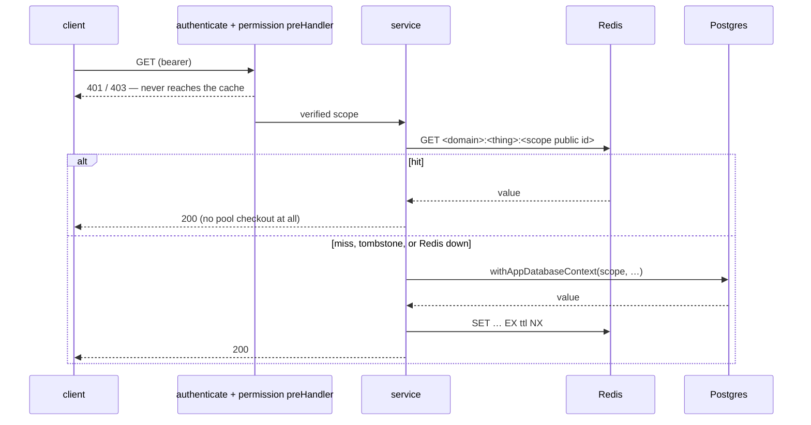

# Read caching (Redis)

How a read gets a Redis cache in this codebase, and — more often the useful answer — why a given read should not get one.

The pattern summary lives in [`src/PATTERNS.md` → read-caching](../../../src/PATTERNS.md). This is the long form: the reasoning, the failure modes, and the checklist.

---

## Why cache at all here

The measured ceiling of this service is ~1,000 req/s on one instance with `pool = 50`, and it is **pool-bound, not CPU-bound**. A non-nested `withAppDatabaseContext` opens a transaction and holds one pooled connection from `BEGIN` to `COMMIT`, so the number of contexts a request opens is close to a direct divisor of throughput.

That is the entire case for a read cache: a hit removes a pool checkout. It is not about Postgres being slow — `SELECT count(*) … WHERE user_id = $1 AND is_read = false` is fast. It is about the connection the query occupies while a hundred other requests wait for one.

## When NOT to cache

Most reads. Work through these before writing a `.cache.ts`:

| Don't cache when | Because |
| --- | --- |
| The read is not frequent | A cache that misses costs a Redis round trip *and* the Postgres query. A rarely-read key is pure overhead with an invalidation surface attached. |
| It already opens one context and returns a big payload | You would be moving bytes, not removing checkouts. "My organizations" is the worked counter-example: one transaction already, and the payload holds expiring presigned URLs. |
| The invalidation surface is wide | If keeping it correct means touching every membership change, every rename and every logo upload, the cache has become a second write path. Wide invalidation is where cache bugs live. |
| Being stale is a correctness or security problem | Redis sits outside RLS. Stale permissions authorize; a stale badge just counts wrong. If the former, the bar is the permission cache's (Sentry on invalidation failure), not this one's. |
| The value is searchable, sortable or paginated | You would be caching one slice of a query space. Cache the answer to a question, not a page of a list. |
| You have not measured | "Might be hot" is not a reason. `read_cache_requests_total` exists so the claim is checkable after the fact; a plausible-sounding cache with a 3 % hit ratio is a regression. |

A read earns a cache by being **frequent, scope-keyed, and cheap to be slightly stale about**. The unread-notification badge — polled by every open tab, keyed on one user, wrong for at most a minute and only ever in the user's favour — is the shape that qualifies.

---

## The four layers

Nothing outside these may talk to Redis for a read cache.

```text
redis.client.ts            one ioredis connection; applies the deployment key prefix
  └── redis-tombstone-cache.util.ts    read · populate (NX) · invalidate (tombstone)
        └── <thing>.cache.ts           key shape · TTL · stored shape · get/set/invalidate
              └── service / controller  reads after authorization; invalidates after commit
```

This is not a generic cache abstraction, and [`cache.overview.md`](../../../src/infrastructure/cache/cache.overview.md) still rules one out. The shared util holds exactly one thing: the three-command race protocol. It was extracted because that protocol had already been hand-written once — in [`session-token-cache.service.ts`](../../../src/domains/auth/sub-domains/auth-session/session-token-cache.service.ts), for revoked bearers — and re-deriving it per cache is how a second cache gets it subtly wrong. Everything else (what the key looks like, how long it lives, what is stored, when it dies) stays in the domain, where it can be argued about.

## Request flow



---

## The three rules that are not style

### 1. Invalidate by writing a tombstone, never by deleting

A `DEL` leaves a race that the TTL does not bound:

```text
reader:  GET (miss) ─── SELECT … ──────────────────────── SET count=5  ← stale, lives a full TTL
writer:                          ── UPDATE … COMMIT ── DEL
```

The reader computed `5` before the write landed and installed it after the delete. Nothing detects this; the wrong value simply serves until it expires.

`invalidateTombstonedCacheEntry` writes a short-lived `__invalidated__` marker instead. It reads back as a miss, and it blocks the reader's `SET … NX`, so the stale value is refused and every reader goes to Postgres until the marker expires.

**Size the tombstone to the race, not to the cache.** The marker only has to outlive the in-flight read that is about to issue its `SET … NX`. That window is bounded by the request-path statement timeout (`DATABASE_HTTP_STATEMENT_TIMEOUT_MS`, 5 s) plus the transaction teardown and one Redis hop, so `CACHE_INVALIDATION_TOMBSTONE_TTL_SECONDS` is 15 s — roughly a 3x margin. Using the cache's own TTL instead is *safe* but wasteful: every write would leave the key cold for a minute, so a user working through their notification inbox would knock the cache out for exactly as long as they keep using it. That is the opposite of what the cache is for.

The exception is a **revocation** tombstone, which must outlive the cached positive entry it overrides or the revoked thing keeps working. That one takes the full cache TTL — see `session-token-cache.service.ts`. Two quantities, two constants; passing one where the other belongs is the live hazard.

**Invalidate after the commit, not inside the transaction.** A tombstone written pre-commit is still *correct* — the racing populate is refused rather than overwriting it — but the marker then has to outlive the rest of the transaction as well, and sizing it for that is what drags a freshness tombstone up to a cache-TTL-length window. Deferring with `runEnqueueAfterCommit` keeps the window down to the in-flight read, and has the separate benefit that a rolled-back write invalidates nothing.

The `NX` on the populate is half of this mechanism. A test that stubs `SET` without honouring `NX` would pass against a `DEL`-based implementation too, which is why [the protocol unit test](../../../src/tests/unit/infrastructure/cache/redis-tombstone-cache.util.unit.test.ts) models `NX` refusal explicitly.

### 2. The key comes from the verified scope, never from a request parameter

Postgres refuses a cross-tenant read. Redis hands over whatever key it is asked for. So:

- `UserPrincipalDatabaseScope` → per user: `notify:unread-count:<userPublicId>`
- `OrganizationPrincipalDatabaseScope` → per organization: `billing:subscriptions:<organizationPublicId>`

Never from `request.params`, `request.query`, or a header. And the cached read happens **after** `authenticate` and the permission preHandler — a cache read in an `onRequest` hook would hand a warm entry to a caller who has not been authorized yet.

Choosing the scope is a claim about row visibility and should be argued in the cache module's TSDoc. The unread count is keyed on the user with no organization segment because `notify.notifications` OR's an owner policy with a tenant policy while the query also filters `user_id = <me>` — so the tenant arm can only add rows the app predicate removes, the visible set is the same in every organization, and an organization segment would fragment one answer into N identical entries with a cold miss on every switch.

### 3. Fail open, and say which kind of failure it is

Every Redis error logs `<cache>.cache.<operation>.failed` and falls through to Postgres: a cache outage is a latency problem, never an availability one. Both halves must be guarded — a cache whose read is wrapped but whose populate is not still throws into the request on a miss.

The asymmetry is what a failed **invalidation** means. For the unread count, it means a badge is wrong for up to a minute: a log line. For the permission cache, it means a revoked grant is still honoured: that one also goes to Sentry. Decide which you are building before you copy the error handling.

---

## Checklist for a new cache

- [ ] The read is frequent, scope-keyed, and tolerant of ≤ 60 s of staleness — and the table above did not talk you out of it.
- [ ] Key `<domain>:<thing>:<scope public id>`, built from the verified scope. **Logical only** — `redis.client.ts` adds the deployment prefix; including it yourself double-prefixes.
- [ ] TTL ≤ 60 s, its own literal in [`ttl.constants.ts`](../../../src/shared/constants/ttl.constants.ts) (not aliased to an unrelated cache's constant), documented in [`POLICIES.md`](../../../src/POLICIES.md).
- [ ] Tombstone TTL is `CACHE_INVALIDATION_TOMBSTONE_TTL_SECONDS`, **not** the cache TTL — unless it is a revocation tombstone, which needs the full cache TTL.
- [ ] Stored shape is JSON-safe — serialize before caching, no `Date` objects or class instances.
- [ ] Module exports the `getCached…` / `setCached…` / `invalidateCached…` trio and records `read_cache_requests_total{cache,result}`.
- [ ] Every write choke point for that key invalidates **after commit** — in the API *and* in any worker. A writer that cannot name the scope (a retention sweep deleting by `created_at`) cannot invalidate; say so in the TSDoc, and state which direction the resulting error goes.
- [ ] Key prefix registered in `TEST_REDIS_PREFIXES` ([`test-redis.ts`](../../../src/tests/helpers/test-redis.ts)). Test teardown recycles ids, so a leftover entry — or its tombstone, which blocks the next `SET NX` — leaks into the next case.
- [ ] Five tests: a hit serving a value Postgres has since changed; invalidation on each write path; scope isolation with two warm callers; the route's gate (401/403) refusing while the entry is warm; Redis-down fallback.

No environment kill switch. A ≤ 60 s TTL self-heals, and reverting the caller is the switch — a flag would be one more untested branch on a hot path.

---

## The other kind: an in-process memo

Not everything that avoids a repeat query is a read cache, and treating the two the same is how a
memo ends up carrying invalidation machinery it does not need — or a cache ends up without any.

The Redis pattern above exists for data that is **scope-keyed** and **changes under you**. Some
data is neither. The public plan catalog and the permission catalog are global — `billing.plans`
and `tenancy.permissions` have no tenant column and no per-caller row filtering — and neither can
change while the API process is running: every writer is a migration or a CLI seed in a different
process. For that shape there is nothing to key on, nothing to invalidate, and no write choke point
to hook, so a Redis cache would be four layers of machinery answering a question nobody asked.

Those use a **module-level TTL memo** instead, following
[`migration-version.ts`](../../../src/infrastructure/database/migration/migration-version.ts):

| | Redis read cache | In-process memo |
| --- | --- | --- |
| Data | scope-keyed, changes at runtime | global, changes only at deploy or seed |
| Key | `<domain>:<thing>:<scope public id>` | none — one value |
| Invalidation | tombstone after every write, in API and workers | none; the TTL is the whole story |
| Shared across processes | yes | no — each process holds its own |
| Name it | `<thing>.cache.ts` | `<thing>-memo.ts` — **not** `.cache.ts`, or `be-read-cache-guard` will hold it to a contract it does not need |

Three things a memo still owes:

1. **Single-flight.** A public unauthenticated route can be driven cold by anyone, so expiry under
   load would otherwise send every concurrent request to the database at once. Share the in-flight
   promise (`readiness-probes.util.ts` is the precedent).
2. **Never memoize a rejection**, and clear the in-flight slot on failure — otherwise one transient
   blip becomes a full TTL of outage.
3. **A `reset…ForTests()` called from `cleanupDatabase`.** A `TRUNCATE` cannot reach process
   memory, so without it one suite's catalog answers the next one's assertions. And any test that
   asserts something about the *database path* — a chaos probe, a query-count budget — must reset
   between probes itself: a per-file reset does not help a single test that probes repeatedly, and
   the failure mode is a test that stays green while proving nothing.

The thing a memo does **not** owe is `read_cache_requests_total`. It is measuring a different
trade: not a pool checkout removed, but a public route that stops touching Postgres at all.

## What is cached today

| Cache | Key | TTL | Invalidated by |
| --- | --- | --- | --- |
| Session token validity | `session:tok:<hash>` | 60 s | logout, revoke, offboarding (tombstone) |
| Organization permissions | `perm:…` | MFA-session window | membership / role / permission writes (+ Sentry on failure) |
| Organization locale | i18n locale cache | short | organization-settings write |
| Unread notification count | `notify:unread-count:<userPublicId>` | 60 s | mark-read, mark-all-read, delete (only when a row went), invite-accepted fan-out — all post-commit, 15 s tombstone |

Memoized in process (not Redis, per the section above): the public plan catalog
(`plan-catalog-memo.ts`) and the permission catalog (`permission-catalog-memo.ts`), 60 s each.

Deliberately **not** cached, with reasons: "my organizations" (one transaction already; presigned URLs in the payload; invalidation spans every membership, rename and logo change), membership and role lists (one transaction, batched, and searchable), and the personal-organization id (two in-transaction round trips would become one Redis hop — not worth an invalidation surface).

---

## Related

- [`src/PATTERNS.md` → read-caching](../../../src/PATTERNS.md) — the pattern contract.
- [`src/PATTERNS.md` → rls-context](../../../src/PATTERNS.md) — one request, one context; the pool argument this doc rests on.
- [`cache.overview.md`](../../../src/infrastructure/cache/cache.overview.md) — the Redis client, TLS, and connection budget.
- [`scalability-and-capacity.md`](../reliability/scalability-and-capacity.md) — where the ~1,000 req/s figure comes from.
