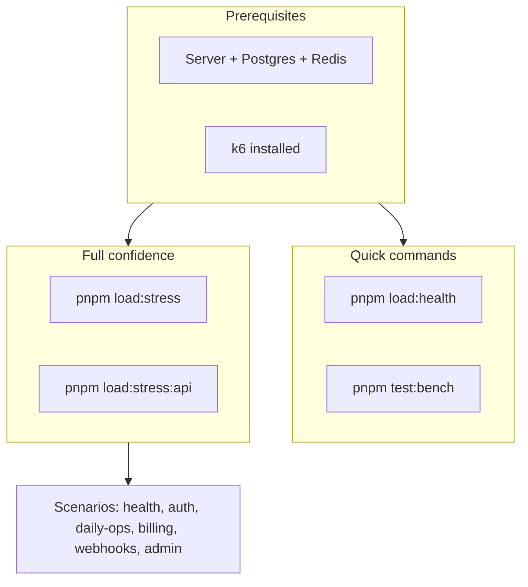

# Load testing

Load tests use [k6](https://k6.io/) and Autocannon. Keep this doc in sync with [src/tests/load/k6/README.md](../../../src/tests/load/k6/README.md).

**Test layout:** Vitest suites (unit, integration, e2e, security, performance) and k6 load assets live under `src/tests/`; domain route tests live under `src/domains/*/__tests__/`. k6 scenarios are in `src/tests/load/k6/` (not Vitest — run via `pnpm load:*`).

---

## Flow overview



Prerequisites → Quick (health, bench) vs Full confidence (stress, stress:api) → Scenarios.

---

## Nightly CI gate (GitHub Actions)

Workflow: [.github/workflows/scheduled-k6-load-slo.yml](../../../.github/workflows/scheduled-k6-load-slo.yml) (`Scheduled k6 API load & SLO`)

Runs **daily at 02:00 UTC** (`cron`) and **on demand** (`workflow_dispatch`, which tests the ref it is started on). The job starts Postgres and Redis service containers, migrates, runs `pnpm db:seed:full` with `DEMO_PASSWORD=DemoPassword123!` (the demo user) and `pnpm db:seed:demo-admin` for `ops@example.com` (the super_admin on `GLOBAL_ADMIN_EMAILS` that the admin scenarios sign in as), boots the API with `RATE_LIMIT_MAX=10000`, then runs k6.

The service containers are plaintext and the connection is the superuser, while the schema defaults are production-safe (TLS on, boot-time safety checks enforced). So the shared `test-env` action exports `DATABASE_SSL_ENABLED=false`, and `start-api-server` relaxes the boot-time checks for its ephemeral boot, as the Docker smoke boot does. Without them the run dies before k6 — the seed fails in the TLS handshake — which kept this nightly red on every run from its first one.

| Role                 | Scenarios                                                                                                                                                                                                                                                                                                                                                                                                                                                                                                                | Job outcome                                                          |
| -------------------- | ------------------------------------------------------------------------------------------------------------------------------------------------------------------------------------------------------------------------------------------------------------------------------------------------------------------------------------------------------------------------------------------------------------------------------------------------------------------------------------------------------------------------ | -------------------------------------------------------------------- |
| **Gate (must pass)** | `health-stress.js`, `api-stress.js`, `login-smoke.js`, `permission-cached.js`, `stripe-webhook-ingest.js`, `idempotency-storm.js`                                                                                                                                                                                                                                                                                                                                                                                        | Workflow **fails** if any k6 threshold fails                         |
| **Informational**    | `auth-onboarding.js`, `passwordless-signup.js`, `daily-ops.js`, `billing.js`, `webhooks.js`, `admin.js`; the organization-scoped set (`audit-list.js`, `org-membership-list.js`, `notification-policy-crud.js`, `billing-subscriptions-rls.js`, `user-data-export.js`, `rls-concurrency-beyond-pool.js`); and the organization writes (`member-role-permission-list.js`, `permission-write.js`, `tenancy-role-write.js`, `organization-settings-write.js`, `notification-write.js`, `organization-api-key-lifecycle.js`); and `fe-full-surface.js`, every call core-fe makes, walked once by each of 20 pool users (the job seeds the pool with `pnpm db:seed:loadtest` and starts the API with `AUTH_STATIC_VERIFICATION_CODE_ACCEPT_ENABLED=true`) | `continue-on-error`; failures do not fail the workflow by themselves |

**SLO-style thresholds (k6):** Scenarios define `http_req_duration` percentiles on tagged requests and `http_req_failed` (see each file under `src/tests/load/k6/scenarios/`). The gate enforces:

- **Health stress**: `health/live` p(95)&lt;200ms, p(99)&lt;500ms; `health/ready` p(95)&lt;500ms, p(99)&lt;1000ms; global failure rate &lt;1%.
- **API stress**: Per-route p(95)&lt;500ms for users/me, organizations, notifications, unread-count, and the active-organization memberships (`/tenancy/organization/memberships`); global p(95)&lt;500ms and failure rate &lt;1%.

Artifacts (`k6-*.json` summaries and `server.log`) are uploaded for 14 days. Optional email: set the `RESEND_API_KEY` and `TEST_RESULT_EMAIL_TO` secrets on the `development` environment; the workflow then invokes `pnpm tool:send-load-test-results-email` with `K6_USE_SUMMARIES=1` (reads the `k6-*.json` summaries — no second k6 run). A red scheduled run opens (or comments on) a `ci-failure` issue titled *Nightly k6 load SLO failing*; the next green nightly closes it.

**Writes, paced.** Every organization write route carries a 100-per-minute cap per (organization, actor) that `RATE_LIMIT_RELAXED_CAPS` does not lift, and a k6 run is one actor (the demo user). The write scenarios therefore use the `pacedWrites` profile in `helpers/config.js` (one iteration per second) rather than 10 closed-loop VUs, which measured the rate limiter (429) instead of the route. Writes take their `X-Idempotency-Key` from `idempotencyKey()` in `helpers/idempotency.js`: the API requires 16–255 characters, and a timestamp keeps a key from replaying an earlier run.

**Route coverage.** `pnpm load:coverage` matches every request the scenario files make — method and path — against `docs/routes.txt`; `pnpm load:coverage --nightly` counts only the files this workflow runs. It skips ROLE and TOKEN routes and public infrastructure routes (OAuth, email sign-in, WebAuthn, the Stripe webhook, health). The nightly count is a ratchet: `tooling/ci/load-coverage-budget.json` records it, and `k6-coverage.policy.unit.test.ts` fails when the nightly load-tests fewer routes — raise the budget when a change adds coverage. Left out on purpose: `POST /notify/webhooks/:webhook_id/test` (it calls the webhook URL live), routes that end the account or the membership (`DELETE /users/me`, organization leave and ownership transfer), and S3- or Stripe-backed writes this job has no backend for.

**Reproduce locally:** `pnpm compose:up`, `pnpm db:migrate`, `DEMO_PASSWORD=DemoPassword123! pnpm db:seed:full`, `pnpm dev:loadtest`, then `pnpm tool:load-test-credentials`, export `TEST_TOKEN` / `TEST_ORG_ID`, and run `pnpm load:stress` and `pnpm load:stress:api` (same thresholds as CI).

---

## Full confidence (recommended)

To gain confidence in the **whole system** (not just health endpoints), run both infrastructure stress and API stress:

1. **Health + infra stress** (no auth): `pnpm load:stress`
   - Hits `GET /livez` and `GET /readyz` with up to 100 VUs.

2. **API stress** (authenticated): set credentials, then run `pnpm load:stress:api`
   - Get credentials: `pnpm tool:load-test-credentials` (server up, `pnpm db:seed:full` done).
   - Export and run:

     ```bash
     export TEST_TOKEN="<paste from script>"
     export TEST_ORG_ID="<paste from script>"
     pnpm load:stress:api
     ```

   - Hits: `GET /api/v1/users/me`, `GET /api/v1/users/me/organizations`, `GET /api/v1/notify/notifications`, `GET /api/v1/notify/notifications/unread-count`, `GET /api/v1/tenancy/organization/memberships` with up to 100 VUs. The active organization rides the token's `org` claim, so `TEST_ORG_ID` scopes the token (via `switchToOrganization`) rather than appearing in the path.

3. **Optional — auth flow**: `pnpm load:auth`
   - Stresses login + profile + list organizations (ramping load profile; see thresholds in `src/tests/load/k6/scenarios/auth-onboarding.js`).

If **load:stress** and **load:stress:api** both pass, the system is under load-tested for both infra and main API paths.

### Failure rate and how to handle it

- **Health stress:** Failure rate is typically **0%** (no auth, no rate limit on health).
- **API stress:** You may see a **high failure rate (~95%+)** if the global **rate limit** is hit. The app uses `RATE_LIMIT_MAX` requests per `RATE_LIMIT_WINDOW_MS` (default **100 per 60 seconds per IP**). k6 runs from one IP with 100 VUs, so you can send thousands of requests per minute; after the first 100 in a window, the server returns **429 Too Many Requests**, which k6 counts as failed.

**How to handle:**

1. **For load-test runs only:** Start the server with a higher limit so API stress can complete without 429s:

   ```bash
   pnpm dev:loadtest
   ```

   (Or `RATE_LIMIT_MAX=10000 pnpm dev`.) Then run `pnpm load:stress:api` (with `TEST_TOKEN` and `TEST_ORG_ID`). Do not use a sky-high limit in production.

2. **In production:** Keep `RATE_LIMIT_MAX` at a level that protects the API (e.g. 100–500 per minute per IP, or use Redis-backed per-user limits). The 429 response is correct behavior when the limit is exceeded; clients should back off or use exponential backoff.

   **Per-route limits:** High-risk routes use tighter caps than the global limit (e.g. login, invitations, data export, webhook test delivery). Values live in [`src/shared/middlewares/rate-limit/rate-limit-presets.constants.ts`](../../../src/shared/middlewares/rate-limit/rate-limit-presets.constants.ts). k6 or scripts that hammer those paths may see 429 sooner than the global budget implies.

3. **Optional — longer-lived token for long runs:** JWT from login expires in 15 minutes. For runs under 15 minutes you don't need to change anything. For longer runs, mint a fresh token between blocks, as the nightly does (`pnpm tool:load-test-credentials` before each block). `pnpm tool:admin-token` is no way around it: a super_admin token lives only `GLOBAL_ADMIN_ACCESS_TOKEN_EXPIRY_SECONDS` (default 5 minutes).

## Interpreting results: co-located load generation

When k6 runs on the **same host** as the API (the common local setup), the load generator and the server compete for the same CPU cores. This caps measured throughput and inflates latency in a way that is **not** an application bottleneck:

- **Symptom:** authenticated-route throughput plateaus (e.g. a few hundred req/s) and server-side compute time (`Server-Timing: app;dur`, mirrored by k6's `http_req_duration`) climbs under high VUs — **even though** Postgres, Redis, the DB connection pool, the libuv threadpool, and the Node event loop all still show headroom.
- **Why:** with the cores saturated by k6 + the server + kernel networking (localhost / Docker-bridge softirq), the OS de-schedules the server mid-request, so its own wall-clock per request grows without any internal resource being saturated. Cached endpoints (`/livez`, `/readyz`) barely notice because their handlers are trivial; authenticated routes do more per-connection work and so reveal a lower co-located ceiling first.
- **Confirm it's the environment, not the app:** raise `DATABASE_POOL_MAX` and `UV_THREADPOOL_SIZE` — if throughput does not move, the pool and crypto/threadpool are not the limit. Compare `app;dur` at low vs high concurrency: if it is small at low load and balloons only under high VUs while infra stays idle, the cap is CPU contention from co-location.

**For true capacity numbers**, run k6 from a **separate host** (so the generator never steals the server's CPU), size the API box to **cores ≥ replicas (+~2 for OS/IO)**, scale processes with `cluster-run.mjs` / `DEPLOYMENT_API_REPLICA_COUNT`, and keep Postgres/Redis on low-latency links (not a localhost port-forward). Treat single-box numbers as **lower bounds and regression signals**, not absolute capacity.

## Load Testing Monitoring (local)

`pnpm load:monitor` starts a recording reverse proxy on **:4985** that forwards to the API on
:3000 and serves a live dashboard of everything passing through it. Point a load run at :4985
instead of :3000 and each call appears as it happens, grouped per route.

```bash
pnpm load:monitor                 # proxy + dashboard on http://localhost:4985
BASE_URL=http://localhost:4985 VUS=50 k6 run src/tests/load/k6/scenarios/fe-login-to-org.js
```

**Port 4985 is fixed and not configurable.** It sits beside the DB viewer's 4984 so the loopback
dev tools occupy one obvious band, and it is deliberately not read from the environment: a bare
`PORT` is the API server's own variable (env schema, default 3000), so a shell exporting it for
the API would silently move this proxy too. `LOAD_MONITOR_UPSTREAM` (default
`http://localhost:3000`) still points it at a different API when you need to.

Node built-ins only — no dependencies. Loopback development tool: it records full request and
response bodies in memory, so never point it at anything but a local API.

| Endpoint | Purpose |
| -------- | ------- |
| `/` | Dashboard — per-route calls, ok/error/429 counts, avg, p95, max, total time |
| `/__monitor/stream` | Server-sent events feed of calls as they land |
| `/__monitor/stats` | Per-route aggregates as JSON |
| `/__monitor/calls` | Recorded calls (`?limit=`) with headers and bodies |
| `/__monitor/clear` | `POST` — reset counters between runs |

Because it sits in the request path it adds a small amount of latency and a second event loop to the
same box; treat its timings as directionally accurate and compare monitor-to-monitor, not
monitor-to-direct.

## Trusting a result

A load-test number is only worth reporting once you know it reproduces. On a co-located single-box
setup this repo has measured a **2.07x spread between two runs of an identical configuration**
(2,697 ms vs 5,590 ms per journey). Any single-run comparison smaller than that is indistinguishable
from noise.

**Before reporting a before/after, satisfy all four:**

1. **Replicate each side at least twice.** A one-shot A/B has produced a confident 3.7x "improvement"
   here that disappeared entirely when the faster side was re-run — the first number was an outlier,
   not a result.
2. **Control for ordering.** Journeys that create rows (organizations, memberships, audit entries)
   leave the database bigger than they found it, so a later run is working against more data than an
   earlier one. Run the pair in both orders; if the effect survives the reversal it is real, and if it
   only appears in one order it was the data growth.
3. **Check the journey against what the client actually calls.** A step the real client never issues
   inflates the route it targets and adds load that does not exist in production. `POST
   /auth/switch-to-organization` returns the active-organization context inline and core-fe writes it straight
   into its cache, so a `GET /auth/me/context` after a switch measures a request the app never makes.
4. **Hold the auth method constant, and know what it costs.** `POST /auth/login` verifies with
   argon2id — roughly 100 ms of deliberate CPU per call. Node runs one thread, so 50 concurrent
   password logins queue several seconds of CPU that inflates *every other route in the run* and can
   trip `overloadGuardMiddleware` into shedding 503s. A journey using password auth and one using
   email-code auth are not comparable, and the difference between them is not an application change.

**Diagnosing a failing journey**

| Symptom | Usual cause |
| ------- | ----------- |
| Login returns `401` for every pool user | Seed data is missing, not a broken feature — the anti-enumeration path returns an **identical** 401 for an unknown email as for a wrong code. Check `auth.users` before debugging the auth code. |
| Login returns `200` but the VU stops right after | The body is an `mfa_required` envelope with `mfa_session_token`, not an `access_token`. See the MFA note under [Obtaining credentials](#obtaining-credentials). |
| Every route inflates by a similar factor | Queueing on the single Node event loop, not a slow endpoint. Uniform inflation is the signature. |
| Only `/auth/refresh` fails, with 429 | `REFRESH_RATE_LIMIT` is a hardcoded 30/min **per IP** and does not honour `RATE_LIMIT_RELAXED_CAPS`, so every VU on one host shares one budget. The limiter working, not the endpoint failing. |

**Report the whole picture.** A journey-level "success rate" counts only VUs that completed *every*
step, so one rate-limited step at the end can read as a 6% success rate while all business routes were
100% healthy. Quote per-route results alongside it.

## Measuring a performance change that is already merged

The section above tells you how to trust a before/after. This one is about the case where there is
no "before" left to run: the change shipped, `main` contains it, and someone asks whether it helped.

**You need two checkouts, not one.** Pick the last commit before the first change in the campaign
and treat it as the baseline; `main` is the other side. Each side needs its own `db:migrate` and
`db:seed:full`, because the database state has to match the code that reads it. Then apply the four
rules above in full — replicate each side twice, run the pair in both orders. That is four runs
minimum, and on a co-located box the 2.07x identical-configuration spread means anything less is
not a measurement.

**Budget the wall clock honestly.** Four journey runs plus two seeds is not a thing to slot between
other work, and a box that is also running a browser or an editor is not a box that can produce the
number. Check `vm.loadavg` and `vm.swapusage` with the cluster down first; uniform inflation across
every route is the signature that you measured the machine instead of the code.

### What to read, for a caching or transaction-count change

| Metric | What it tells you |
| --- | --- |
| Per-route p95 | The user-visible effect. Read this **before** the aggregate — a change to three routes barely moves a mix of sixteen. |
| `pg_pool_waiting` | Requests queued for a connection. This is the ceiling a transaction-count change is aimed at. |
| `database_rls_active_checkouts` | Should fall if contexts were folded. |
| `database_rls_checkout_hold_seconds` | How long each checkout pins its connection. |
| `read_cache_requests_total{cache,result}` | The hit ratio, per cache. |

**A cache's hit ratio is its falsification test, and it must come from a realistic journey.** A
synthetic loop against one endpoint will show a ratio near 100% and prove nothing — the number only
means something when writes are invalidating at the rate they really do. A ratio near zero under a
real journey means that cache is paying a Redis round trip to still ask Postgres, and the correct
response is to remove it. Measuring it exists to make that outcome possible, not to confirm a
decision already made.

**Counts are not throughput.** A transaction-per-request budget (see
[`request-transaction-budget.integration.test.ts`](../../../src/tests/integration/database/request-transaction-budget.integration.test.ts))
proves a route stopped taking two pool checkouts. It does not prove the service got faster, and the
two claims should not be reported as if they were the same one.

## Post-run settle check (drain + assert clean)

After a load (or e2e) batch, `pnpm load:settle-check` proves the async fabric finished every job the run started — nothing stuck in a queue, the event-bus / outbox side effects flushed, and nothing dead-lettered. Run it against the **same** API + worker the load test hit (workers must be running so the backlog can drain):

```bash
pnpm load:settle-check
```

It polls the throughput queues (`mail`, `webhook-delivery`, `notification`, `stripe-webhook`) until `waiting + active + delayed = 0` and the mail outbox has no pending rows, then asserts — once — that **no** queue and **no** `<queue>-dlq` is holding a failed job. Exit code `0` = clean, `1` = did not settle within the timeout or a failure remains (CI-gateable). Scheduled retention/tombstone queues are intentionally excluded: their next repeatable run always sits in `delayed`, so they never reach zero — their health is covered instead by the cluster-wide dead-letter assertion.

| Env | Default | Purpose |
| --- | ------- | ------- |
| `SETTLE_CHECK_TIMEOUT_MS` | `120000` | Max wait for the backlog to drain before reporting a timeout |
| `SETTLE_CHECK_POLL_INTERVAL_MS` | `2000` | Poll cadence while waiting |
| `SETTLE_CHECK_QUEUES` | throughput queues | Comma-separated queue-name override |

The same signals are observable live via `GET /readyz` (verbose), `GET /metrics` (`bullmq_queue_*`, `mail_outbox_pending`, `dlq_depth`), and Bull Board — see the [observability runbook](../../deployment/runbooks/observability.md). The settle check turns those gauges into a single pass/fail gate.

## Prerequisites

- **Server**: Run the API with `pnpm dev` (and optionally `pnpm dev:worker` for background jobs).
- **Postgres + Redis**: Required for auth and organization-dependent scenarios. Start with `docker compose up -d` or your own instances.
- **Database**: Migrations applied (`pnpm db:migrate`). For auth and organization scenarios, run full seed: `pnpm db:seed:full` (creates demo user `demo@example.com` / `DemoPassword123!` and a demo organization).
- **k6**: Install [k6](https://k6.io/docs/get-started/installation/) for scenario runs.

## Quick commands (no auth)

- **Autocannon** (single endpoint): `pnpm test:bench` — hits `http://localhost:3000/readyz`.
- **k6 health**: `pnpm load:health` — runs `src/tests/load/k6/scenarios/health.js` (`/livez` and `/readyz`). No env vars needed.

## Scenarios (all eight)

### 1. Health

- **File**: `src/tests/load/k6/scenarios/health.js`
- **Auth**: None
- **Env**: Optional `BASE_URL` (default `http://localhost:3000`)
- **Run**: `pnpm load:health` or `k6 run src/tests/load/k6/scenarios/health.js`

### 2. API stress (full confidence)

- **File**: `src/tests/load/k6/scenarios/api-stress.js`
- **Auth**: Bearer token (TEST_TOKEN) + TEST_ORG_ID for memberships
- **Env**: `TEST_TOKEN` (required), `TEST_ORG_ID` (required for memberships). Get via `pnpm tool:load-test-credentials`.
- **Run**: `pnpm load:stress:api` after exporting TEST_TOKEN and TEST_ORG_ID.
- **Routes**: users/me, users/me/organizations, notify/notifications, notify/notifications/unread-count, tenancy/organization/memberships (active organization from the token claim; `TEST_ORG_ID` scopes the token, not the path). Stress profile: 20→50→100 VUs.

### 3. Auth onboarding

- **File**: `src/tests/load/k6/scenarios/auth-onboarding.js`
- **Auth**: Login with email/password, then profile and list organizations
- **Env**: `TEST_EMAIL`, `TEST_PASSWORD` (defaults in script: `test@test.com` / `test-password`). After full seed use: `TEST_EMAIL=demo@example.com` and `TEST_PASSWORD=DemoPassword123!`
- **Run**: `pnpm load:auth` (uses demo credentials by default) or `k6 run src/tests/load/k6/scenarios/auth-onboarding.js`

### 4. Daily ops

- **File**: `src/tests/load/k6/scenarios/daily-ops.js`
- **Auth**: Bearer token scoped to the active organization (the `org` claim; scope via `TEST_ORG_ID`)
- **Env**: `TEST_TOKEN` (required), `TEST_ORG_ID` (default `test-organization-id`). Use the helper script to get token and organization id: `pnpm tool:load-test-credentials` (see below).
- **Run**: `pnpm load:daily-ops` with `TEST_TOKEN` and `TEST_ORG_ID`, or `TEST_TOKEN=<token> TEST_ORG_ID=<org_public_id> k6 run src/tests/load/k6/scenarios/daily-ops.js`

### 5. Billing

- **File**: `src/tests/load/k6/scenarios/billing.js`
- **Auth**: First request (list plans) is public; rest require `TEST_TOKEN` and `TEST_ORG_ID`
- **Env**: `TEST_TOKEN`, `TEST_ORG_ID` (optional; if missing, only list-plans is exercised)
- **Run**: `pnpm load:billing` with `TEST_TOKEN` and `TEST_ORG_ID`, or `TEST_TOKEN=<token> TEST_ORG_ID=<org_public_id> k6 run src/tests/load/k6/scenarios/billing.js`

### 6. Webhooks

- **File**: `src/tests/load/k6/scenarios/webhooks.js`
- **Auth**: Bearer token scoped to the active organization (the `org` claim; scope via `TEST_ORG_ID`)
- **Env**: `TEST_TOKEN` (required), `TEST_ORG_ID` (default `test-organization-id`)
- **Run**: `pnpm load:webhooks` with `TEST_TOKEN` and `TEST_ORG_ID`, or `TEST_TOKEN=<token> TEST_ORG_ID=<org_public_id> k6 run src/tests/load/k6/scenarios/webhooks.js`

### 7. Admin

- **File**: `src/tests/load/k6/scenarios/admin.js`
- **Auth**: A `super_admin` session. Sign-in grants that role only to an email on `GLOBAL_ADMIN_EMAILS`; `pnpm tool:admin-token` signs in as one (see below).
- **Env**: `ADMIN_TOKEN` (required)
- **Run**: `pnpm load:admin` with `ADMIN_TOKEN`, or `ADMIN_TOKEN=<token> k6 run src/tests/load/k6/scenarios/admin.js`. Obtain token via: `pnpm tool:admin-token` (see below).

### 8. core-fe full journey

Walks the complete front-end user journey once per virtual user, so **VUs are users** — 50 VUs means
50 people each performing the journey a single time, not 50 people looping.

- **File**: `src/tests/load/k6/scenarios/fe-login-to-org.js`
- **Auth**: `AUTH=code` (default) logs in with `AUTH_STATIC_VERIFICATION_CODE_ACCEPT_ENABLED`; `AUTH=password` uses
  `POST /auth/login`; `AUTH=otp` does the real `send-code` → read `debug_verification_code` → login
  round trip (needs `TEST_MODE=true`).
- **Credentials**: the pool at `src/tests/load/k6/data/credential-pool.json` — build it with
  `pnpm db:seed:loadtest`.
- **Routes** (16): guest refresh → send-code → login → me/context → profile patch → create organization →
  onboarding complete → switch organization → me/context again → workspace and dashboard reads →
  authed refresh → logout.

| Env | Default | Purpose |
| --- | ------- | ------- |
| `VUS` | `50` | Virtual users; each performs the journey once |
| `POOL` | — | `DATABASE_POOL_MAX` the API was started with; printed in the header for the record |
| `AUTH` | `code` | `code` \| `password` \| `otp` |
| `STATIC_CODE` | `TEST24` | Must match the API's `AUTH_STATIC_VERIFICATION_CODE_ACCEPT_ENABLED` |
| `STAGGER` | `5` | Milliseconds between VU starts, to avoid a synthetic thundering herd |
| `RESULT_TAG` | — | Label recorded with the run |

**`send-code` is measured but not depended on.** The journey issues it because the real client always
does and its cost belongs in the numbers, but login presents `AUTH_STATIC_VERIFICATION_CODE_ACCEPT_ENABLED` rather
than the code `send-code` issued, so the two calls stay independent and a non-200 on `send-code` does
not abort the journey.

**The second `me/context` after the organization switch is a benchmark, not a fidelity claim.** core-fe does
**not** make that call — `switch-to-organization` already returns the active-organization context inline and
the client writes it into its cache with `setQueryData` (verified against live responses: the switch
payload's `active_organization` and `my_permissions` are byte-identical to what the re-read returns).
The step exists because that route is
the largest single consumer of API time in the run — 100 calls / ~16% of total — which makes it the
benchmark any caching work has to beat. Of its four reads only `my_permissions` is Redis-cached
today. When reading the report, treat step 09 as a **caching target**, not as production traffic, and
subtract it before quoting a per-user total as what a real session costs — see point 3 under
[Trusting a result](#trusting-a-result).

Requires the API started with `TEST_MODE=true` and `AUTH_STATIC_VERIFICATION_CODE_ACCEPT_ENABLED` turned on:

```bash
TEST_MODE=true AUTH_STATIC_VERIFICATION_CODE_ACCEPT_ENABLED=true DATABASE_POOL_MAX=50 pnpm dev
# then
BASE_URL=http://localhost:3000 VUS=50 POOL=50 k6 run src/tests/load/k6/scenarios/fe-login-to-org.js
```

### Org-scoped / RLS-heavy (informational, CI nightly)

Org-scoped scenarios resolve the tenant from the token's `org` claim — no organization path segment and no
any organization header. `TEST_ORG_ID` is used to **scope the token** to that organization (the helpers
call `switchToOrganization` / `loginScopedToOrganization`), not to build the path.

| File | Env | Routes |
| ---- | --- | ------ |
| `audit-list.js` | `ADMIN_TOKEN` | `GET /api/v1/audit/logs` |
| `org-membership-list.js` | `TEST_TOKEN`, `TEST_ORG_ID` | `GET /api/v1/tenancy/organization/memberships` |
| `member-role-permission-list.js` | `TEST_TOKEN`, `TEST_ORG_ID`, `TEST_ROLE_ID` | `GET /api/v1/tenancy/organization/roles/:role_id/permissions` |
| `notification-policy-crud.js` | `TEST_TOKEN`, `TEST_ORG_ID` | `GET /api/v1/tenancy/organization/notification-policies` |
| `billing-subscriptions-rls.js` | `TEST_TOKEN`, `TEST_ORG_ID`, optional `TEST_SUBSCRIPTION_ID` | `GET /api/v1/billing/subscriptions` |
| `upload-list.js` | `TEST_TOKEN`, optional `TEST_UPLOAD_PUBLIC_ID` | `GET /api/v1/uploads/:id` |
| `user-data-export.js` | `TEST_TOKEN` | `POST /api/v1/users/me/data-export` |

CI runs a subset in the **organization-scoped routes** job step (see `scheduled-k6-load-slo.yml`).

### RLS concurrency beyond pool size

- **File**: `src/tests/load/k6/scenarios/rls-concurrency-beyond-pool.js`
- **Auth**: Bearer token scoped to the active organization (the `org` claim; scope via `TEST_ORG_ID`)
- **Env**: `TEST_TOKEN`, `TEST_ORG_ID` (required); optional `DATABASE_POOL_MAX` (default `10`), `BEYOND_POOL_FACTOR` (default `4`), `BEYOND_POOL_VUS` (explicit VU override)
- **Run**: `RATE_LIMIT_MAX=10000 pnpm dev` (or `pnpm dev:loadtest`), then `pnpm load:rls-concurrency` with `TEST_TOKEN` and `TEST_ORG_ID`
- **Rate limit**: This scenario drives `DATABASE_POOL_MAX × BEYOND_POOL_FACTOR` VUs (default 40) with a short `sleep`, so it sends far more than the default global limit of `RATE_LIMIT_MAX` (100) requests per `RATE_LIMIT_WINDOW_MS` (60s) per IP. Without raising `RATE_LIMIT_MAX`, k6 will count `429 Too Many Requests` as failures and breach the `http_req_failed < 1%` threshold even when the pool is healthy. Match the server's `DATABASE_POOL_MAX` when overriding it on the k6 side.
- **Purpose**: Validates production-readiness audit item #5 (per-request RLS transaction pinning). It ramps concurrent VUs to `DATABASE_POOL_MAX × BEYOND_POOL_FACTOR` against an organization-scoped (RLS) endpoint (`GET .../memberships`) and asserts `http_req_failed` stays below 1%. With `DATABASE_RLS_SCOPED_CONTEXTS=true` the connection checkout is held only for the unit-of-work, so the pool absorbs several multiples of concurrent requests; under the legacy request-pinned model the API would saturate near `DATABASE_POOL_MAX` and later requests would block or fail.
- **CI**: Runs nightly as part of the **organization-scoped routes** informational step in `scheduled-k6-load-slo.yml` (seeded full demo data guarantees `TEST_ORG_ID`; the workflow already boots the API with `RATE_LIMIT_MAX=10000`). Pair a manual run with the `database_rls_active_checkouts` / `database_rls_checkout_hold_seconds` metrics from the [resource-limits runbook](../../deployment/runbooks/resource-limits.md) to confirm checkout hold time stays short.

## Obtaining credentials

- **TEST_TOKEN and TEST_ORG_ID**: Run `pnpm tool:load-test-credentials` (with server up and full seed). It logs in as the demo user, lists organizations, and prints `TEST_TOKEN` and `TEST_ORG_ID` for copy-paste.
- **Credential pool**: Run `pnpm db:seed:loadtest` (bulk seed + pool export). The generator **excludes MFA accounts** — both `users.is_mfa_enabled` and membership of an organization whose `security_policy.mfa_required` is true, mirroring the login gate in `completeFirstFactorAuth`. Such an account returns HTTP 200 with an `mfa_required` envelope instead of an `access_token`, so a VU drawing one would read no token and quietly abandon its journey. The bulk seeder sets `mfa_required` on a share of its organizations, so without the filter roughly a third of the pool is unusable.
- **ADMIN_TOKEN**: Create the account once with `DEMO_EMAIL=<admin email> pnpm db:seed:demo-admin` (it takes `DEMO_PASSWORD`) and put the email on `GLOBAL_ADMIN_EMAILS`. Then, with the server up, run `pnpm tool:admin-token`. It signs in as `ADMIN_EMAIL` (default: the first `GLOBAL_ADMIN_EMAILS` entry) with `ADMIN_PASSWORD` (default: `DEMO_PASSWORD`) and prints the access token, refusing unless the role is `super_admin`. The token belongs to a real session: the auth middleware refuses a token whose session does not exist, which is why the self-signed token this tool used to print failed every admin request. It lives `GLOBAL_ADMIN_ACCESS_TOKEN_EXPIRY_SECONDS` (default 5 minutes).

## Optional env (all scenarios)

- `BASE_URL`: API base URL (default `http://localhost:3000`). k6 reads this as `__ENV.BASE_URL`.
