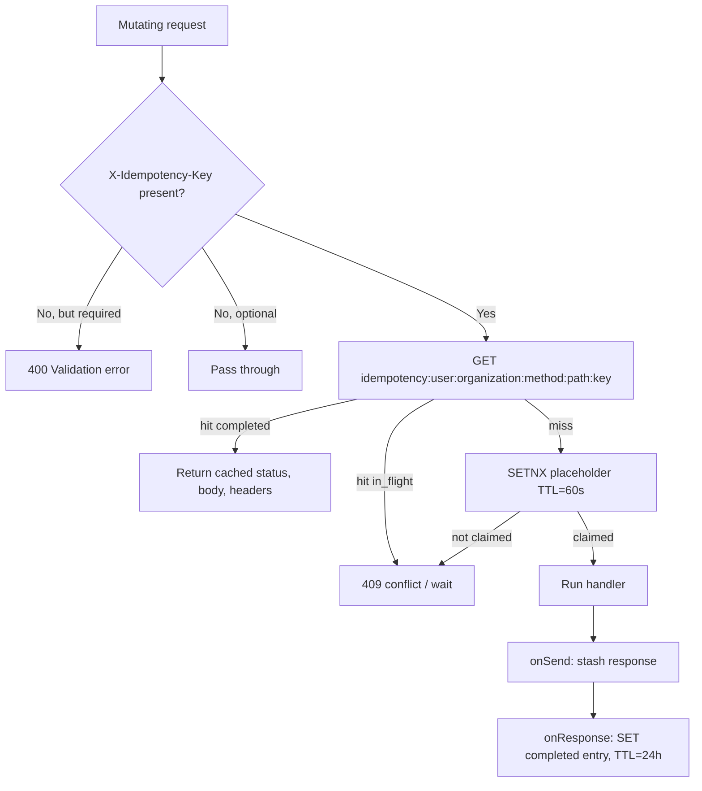
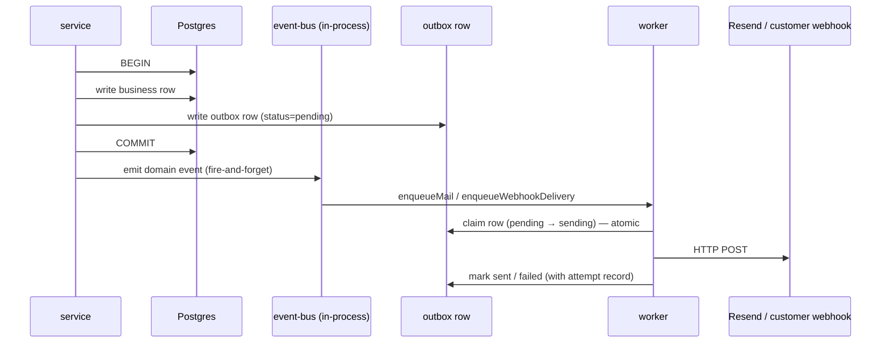
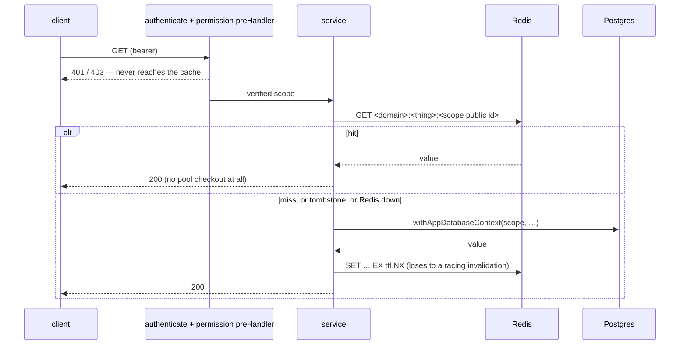

`src/`

# Cross-cutting patterns

These patterns are implemented identically across the codebase. When a domain `<folder>.overview.md` says **Patterns used: tenant-isolation, audit-emission**, it is asserting that domain follows the contract documented here. Drift = bug.

Each entry follows the same shape: **Purpose**, **Where it lives**, **Implementation**, **How to apply**.

## tenant-isolation

### Purpose

Prevent cross-tenant data leaks. Every read and write performed under an organization scope is filtered by `organization_id`, and the database enforces that filter via Row-Level Security as a defense-in-depth layer. A single misplaced query that forgets the filter must not be enough to leak another tenant's rows.

### Where it lives

- HTTP layer: [src/shared/middlewares/core/auth.middleware.ts](src/shared/middlewares/core/auth.middleware.ts) — verifies the JWT / API key and eagerly attaches `request.principalScope` (plus the claim-derived `request.organizationId` decoration). The **authoritative** active organization is the signed `org` JWT claim; routes carry no `{organization_id}` path segment and the legacy `X-Organization-Id` header was removed.
- Database layer: [src/infrastructure/database/contexts/database-context.ts](src/infrastructure/database/contexts/database-context.ts) — `withAppDatabaseContext(scope, …)` opens a Drizzle transaction and sets the identity GUCs (`app.current_organization_public_id` / `app.current_user_public_id`) from the token-minted principal scope in one `set_config` statement. RLS policies on organization-scoped tables read those GUCs.
- Worker layer: [src/infrastructure/queue/worker-runtime/worker-processor.util.ts](src/infrastructure/queue/worker-runtime/worker-processor.util.ts) — `runOrganizationScopedWorkerJob` requires `organizationPublicId` in the job payload and wraps the processor body in `withAppDatabaseContext` (with a job-minted principal scope) so RLS sees the same GUC the HTTP layer would have set.

### Implementation

```mermaid
sequenceDiagram
  participant Client
  participant Auth as auth.middleware
  participant Ctl as controller
  participant Svc as service
  participant Ctx as withAppDatabaseContext
  participant DB as Postgres (RLS)
  Client->>Auth: HTTP request (Bearer JWT, signed org claim)
  Auth->>Auth: verify JWT; attach request.principalScope
  Ctl->>Ctl: requireOrganizationScope(request) — 403 without an organization
  Ctl->>Svc: service.method(scope, dto)
  Svc->>Ctx: withAppDatabaseContext(scope, fn)
  Ctx->>DB: BEGIN; SET LOCAL app.current_organization_public_id
  Ctx->>Svc: pinned databaseHandle (transaction)
  Svc->>DB: SELECT/INSERT/UPDATE (RLS filters by organization)
  Ctx->>DB: COMMIT
```

The same context is reused if a worker is already running inside one (no nested top-level transaction; no second pool checkout; no lost `SET LOCAL`).

### How to apply

- New tenant-scoped repository: extend `BaseRepository`, scope every query by `organization_id`. Any RLS-eligible table also needs an RLS policy in its migration.
- New tenant-scoped service method: wrap database I/O in `withAppDatabaseContext(scope, fn)` — the scope is attached by the auth middleware, narrowed at the controller (`requireOrganizationScope(request)`), and relayed through the service. **Network I/O (Stripe, S3, Resend) MUST stay outside** the wrapper to avoid holding a pool checkout across remote round trips — enforced by `pnpm test:global` (`rls-context-network-isolation.global.test.ts`).
- New worker job: use `runOrganizationScopedWorkerJob`; never call `getRequestDatabase()` from a `*.worker.ts` / `*.processor.ts` (enforced by global tests).
- New tenant-scoped endpoint: the active organization comes from the `org` JWT claim (no `{organization_id}` path segment); narrow `request.principalScope` with `requireOrganizationScope(request)` at the controller and pass it into `withAppDatabaseContext`.

## audit-emission

### Purpose

Every security- or governance-relevant write stages a row in the `audit.outbox` table inside the caller's transaction; the audit drain worker later inserts it into `audit.logs` so post-hoc investigation always has a non-repudiable trail. Audit failures must never fail the originating request — the user-visible operation is the source of truth and the audit row is best-effort.

### Where it lives

- Domain: [src/domains/audit/](src/domains/audit/) owns the audit write path and the `audit.outbox` → `audit.logs` drain worker.
- Caller helper: [src/shared/utils/infrastructure/audit-request-context.util.ts](src/shared/utils/infrastructure/audit-request-context.util.ts) — `recordScopedAuditEvent(request, input)` fills in IP / user-agent / actor fields and stages the outbox row. It wraps [audit-record.util.ts](src/shared/utils/infrastructure/audit-record.util.ts)'s `recordAuditEvent`, which swallows + logs failures so callers don't need a try/catch.

### Implementation

1. Handler performs its primary write (e.g. an organization or auth-method mutation).
2. The handler calls `recordScopedAuditEvent(request, { actorUserPublicId | actorApiKeyPublicId, action, resource_type, resource_id, organization_public_id, severity, metadata })` — network context (IP, user-agent, request id) is filled in by the helper.
3. The row is staged in `audit.outbox` inside the caller's transaction (no synchronous id lookup). The audit drain worker later resolves internal ids and inserts into `audit.logs`.
4. Errors are caught and logged at `warn`; the originating request still returns success.

### How to apply

- Adding a security-relevant route: identify the action constant (or add one in [src/domains/audit/audit.types.ts](src/domains/audit/audit.types.ts)), call `recordScopedAuditEvent(request, {...})` after the primary write, populate `metadata` with the diff or operation parameters that future investigators will need.
- Severity defaults to `INFO`. Use `WARNING` for failed-but-recorded actions (e.g. permission denied) and `CRITICAL` for global-admin lifecycle events.

## idempotency

### Purpose

Mutating endpoints (`POST` / `PUT` / `PATCH` / `DELETE`) accept an `X-Idempotency-Key` header so retries from network errors return the original response instead of executing the operation a second time. For routes marked `idempotencyRequired: true` in their `schema.config`, the header is mandatory.

### Where it lives

- Middleware: [src/shared/middlewares/core/idempotency.middleware.ts](src/shared/middlewares/core/idempotency.middleware.ts).
- Redis: keys live under the `idempotency:` prefix; payload caps at `IDEMPOTENCY_CACHED_BODY_BYTES` (100 KiB); TTL = `IDEMPOTENCY_RESPONSE_CACHE_TTL_SECONDS` (24 h) for completed entries and `IDEMPOTENCY_PLACEHOLDER_TTL_SECONDS` (60 s) for in-flight placeholders.
- Cardinality guard: [src/infrastructure/observability/idempotency-cardinality/](src/infrastructure/observability/idempotency-cardinality/) — bounded SCAN job that warns when the key set exceeds threshold.

### Implementation



Scope key includes `userId` / `organizationId` / `apiKeyPublicId` so two clients can use the same `X-Idempotency-Key` value without collision.

### How to apply

- Make a route required-idempotent: add `config: { idempotencyRequired: true }` to the route options. The middleware will throw `400` if the header is missing.
- Forward to Stripe: pass the same `Idempotency-Key` to Stripe's API; Stripe honors it for 24 h, matching our TTL.
- Bodies above 100 KiB cannot be replayed; the middleware logs a warning and skips caching. Design endpoints with retry replay in mind to stay under the cap.

## soft-delete

### Purpose

Most user- and organization-owned rows use a `deleted_at TIMESTAMPTZ` column instead of physical `DELETE`. This preserves audit trails, lets retention sweeps run independently of user-facing deletes, and keeps foreign-key references intact while the row is "gone" from the API.

Some tables are deliberately exempt: immutable billing ledgers (audit, ledger entries, invoices) never soft-delete because changing or removing a billing event is a compliance risk. Hard `DELETE` is the right call there only after the retention window passes.

### Where it lives

- Schema definitions: every soft-deletable table declares `deleted_at: timestamp('deleted_at', { withTimezone: true })`.
- Repositories: list/find methods filter `WHERE deleted_at IS NULL` by default; explicit `includeDeleted` flag is opt-in for admin/forensic paths.
- Tombstone retention workers: [src/domains/tenancy/sub-domains/organization/organization-notification-policy/workers/organization-notification-policy-tombstone-retention.processor.ts](src/domains/tenancy/sub-domains/organization/organization-notification-policy/workers/organization-notification-policy-tombstone-retention.processor.ts) and similar — sweep tombstoned rows after a retention window.

### Implementation

1. `service.delete(id)` calls the repository's `softDelete(id)` which sets `deleted_at = NOW()` and emits any associated events.
2. All read paths automatically exclude soft-deleted rows via `WHERE deleted_at IS NULL`. Joins to soft-deleted rows are tested explicitly — the join filter is part of the repository contract.
3. A retention BullMQ job (registered in [src/infrastructure/queue/scheduler.ts](src/infrastructure/queue/scheduler.ts)) periodically hard-deletes tombstones older than the retention window.

### How to apply

- New table: add `deleted_at` unless the table is an immutable ledger. If exempt, document **why** in the schema file.
- New repository: any query that returns user-visible rows must include `eq(table.deleted_at, null)` or use a base helper that does.
- Forensic / admin paths: opt out explicitly via a documented `includeDeleted: true` flag.

## rls-context

### Purpose

Postgres Row-Level Security is the **defense-in-depth** layer for tenant isolation: even if a query forgets `WHERE organization_id = $1`, the database refuses to return rows that don't match the active organization GUC. Workers must obey the same contract — they must not skip RLS just because they're "internal".

### Where it lives

- Context wrappers: [src/infrastructure/database/contexts/](src/infrastructure/database/contexts/) — exactly three scope patterns behind two wrappers: `withAppDatabaseContext` (principal scopes — request, job, or verified source — and pre-auth `SESSION_SCOPE` artifacts; the scope decides the GUCs) and `withMaintenanceDatabaseContext` with the static `MAINTENANCE_SCOPE.<kind>` singletons (the whole bypass family: global_retention_cleanup, session_retention_cleanup, global_admin, system_audit_insert, audit_outbox_drain, system_table_retention, system_table_worker).
- Principal scope minting: the `PRINCIPAL_SCOPE` family namespace in [database-context.ts](src/infrastructure/database/contexts/database-context.ts) — `.REQUEST` (auth middleware attaches `request.principalScope` from the verified token ids, both `user` and `apiKey` principal kinds), `.JOB` (worker-runtime, zod-validated payload ids), `.VERIFIED` (ledgered self-verified flows). Controllers narrow via `requireOrganizationScope(request)` / `requireUserScope(request)` in [request.util.ts](src/shared/utils/http/request.util.ts) and relay into `withAppDatabaseContext`; nothing can fabricate a scope from raw strings (per-member confinement pinned by `principal-scope-minting.policy.unit.test.ts`). Provenance is edge-only; bypass GUCs have no minter and no path through the app wrapper.
- Worker runtime: `runOrganizationScopedWorkerJob`, `runGlobalRetentionWorkerJob`, `runUserScopedWorkerJob` in [src/infrastructure/queue/worker-runtime/worker-processor.util.ts](src/infrastructure/queue/worker-runtime/worker-processor.util.ts).
- Migration: `migrations/00000000000000_init.sql` (consolidated baseline; defines the `app.global_retention_cleanup` RLS bypass policies) and other RLS-policy migrations under [migrations/](migrations/).

### Implementation

- HTTP requests get RLS via `tenant.middleware` + `organization-rls-transaction.middleware` opening a request-scoped transaction with `SET LOCAL app.current_organization_public_id = $1`.
- Workers get RLS via `runOrganizationScopedWorkerJob` which **requires** `organizationPublicId` in the job payload and opens its own `withAppDatabaseContext` transaction (job-minted organization scope). Workers are forbidden from importing `database-context-runtime.ts` (enforced by `worker-database-guard.unit.test.ts` and global tests).
- Global-scope workers (cross-organization sweeps) use `withMaintenanceDatabaseContext(MAINTENANCE_SCOPE.GLOBAL_RETENTION_CLEANUP, …)`, which sets a different GUC that RLS policies recognize as "global retention" — strictly limited to retention/cleanup operations.

### Each context grants only what a policy names

A context sets **one** GUC. It grants access only on tables whose policies test that GUC — picking the wrong context does not raise an error, it silently returns **zero rows** (or fails a `WITH CHECK` with SQLSTATE 42501 on write).

| Context | GUC it sets | Grants on |
| --- | --- | --- |
| `withAppDatabaseContext` (organization scope) | `app.current_organization_public_id` | tenant-scoped tables (`organizations_tenant_isolation` and the per-table `*_tenant_isolation` policies) |
| `withAppDatabaseContext` (user scope) | `app.current_user_public_id` | user-owned rows — `auth.users`, `auth.auth_methods`, uploads/notifications, **and the tenancy discovery policies** (`organizations_user_discovery`, `memberships_user_self_discovery`) |
| `MAINTENANCE_SCOPE.GLOBAL_ADMIN` | `app.global_admin` | **`auth.*` and `audit.logs` ONLY** |
| `MAINTENANCE_SCOPE.GLOBAL_RETENTION_CLEANUP` | `app.global_retention_cleanup` | retention-sweep tables only |

**`app.global_admin` grants nothing on `tenancy.*`.** No tenancy policy carries that arm — the tenancy tables are reachable only through the active-organization GUC or the user GUC. Reading `tenancy.organizations` / `tenancy.memberships` under the admin context returns zero rows; writing fails its `WITH CHECK`. This shipped to production three times (organization provisioning, active-organization resolution at login, and the `OrganizationRepository` user-id resolvers) before being pinned by [no-global-admin-in-tenancy.global.test.ts](src/tests/global/no-global-admin-in-tenancy.global.test.ts) and [tenancy-global-admin-invisibility.security.test.ts](src/tests/security/rls/tenancy-global-admin-invisibility.security.test.ts).

To read `auth.users` from a context that is not the user's own (e.g. inside organization context, or post-commit with no GUC), use an `auth.*` **SECURITY DEFINER** resolver — `auth.resolve_user_id_by_public_id`, `auth.resolve_user_by_internal_id`, `auth.resolve_user_public_ids_by_ids` — never a direct join.

### Connection-holding discipline

These four properties hold today and are what keep lock contention from becoming pool exhaustion. Three are conventions — breaking one is a silent regression, not a build error.

| Property | Why it matters | Status |
| --- | --- | --- |
| **Transactions are callback-scoped** — zero `.commit()` / `.rollback()` in `src/domains`, `src/shared`, `src/core` | Makes the "early return between BEGIN and COMMIT leaks a transaction holding its row locks" defect class **unwritable** | verified, convention |
| **Every `set_config` passes `true`** (transaction-scoped) | A session-scoped identity survives on a pooled connection and leaks the previous caller's tenant to the next one | verified, convention |
| **No batch-and-parallel write fan-out** — no slicing an id list and dispatching the chunks through `Promise.all` | Postgres serialises the statements on one connection anyway, so the concurrency buys nothing while every statement's row locks are held until COMMIT — the lock window grows with the batch count. Issue one statement for the whole list, or chunk **sequentially** | verified, convention |
| **Bounded post-commit fan-out** — `flushOnCommit` runs at most `MAX_CONCURRENT_ON_COMMIT_TASKS` tasks at once | A post-commit task that touches the database opens its own scoped context, so unbounded dispatch made one request's connection demand equal its queue length | enforced in code |

**Three timeouts, three different failures, no substitutes** (all connection parameters, see [database.overview.md](src/infrastructure/database/database.overview.md)): `statement_timeout` bounds a running query, `idle_in_transaction_session_timeout` bounds an open-and-idle transaction, `lock_timeout` bounds a statement **blocked behind someone else's lock**. A lock waiter is neither running nor idle, so only `lock_timeout` bounds it — while it holds its pooled checkout for the entire wait.

### How to apply

- New tenant-scoped table: add an RLS policy in its migration. The migration linter (`pnpm db:migrate:lint`) rejects schemas that omit RLS where it's required.
- New worker: pick the right runner (`Tenant`, `Global`, `User`) and pass the right context payload. Don't call `getRequestDatabase()`; don't import from `database-context-runtime.ts`. The pre-commit `validate:domain` enforces this at the import-graph level.

### One request, one context

A non-nested `withAppDatabaseContext` is not free bookkeeping: it opens a transaction and **holds one pooled connection from BEGIN to COMMIT**. The measured ceiling of this service (~1,000 req/s on one instance, pool = 50) is set by that pool, not by CPU, so the number of contexts a request opens is close to a direct divisor of throughput.

Nesting is already handled: a context whose scope matches the one above it **reuses the pinned checkout** instead of taking a second (`runPrincipalDatabaseContext` — same-organization reuse, and user-only scopes reuse any pinned handle). So the rule is about where you call things, not about adding machinery.

- **Resolve ids inside the context that needs them.** The recurring defect is `public_id → internal id` resolved through a service that opens its own transaction, *before* opening the context the handler actually reads in: two checkouts, ~4 extra round trips, for a value the request already carried the public id for. Use {@link UserService.resolveInternalIdByPublicId} (one SECURITY DEFINER call, no context of its own) from inside the context — never `findUserRecordByPublicId` when only the id is wanted.
- **Push the resolution into the query** where a repository can: `auth.resolve_user_id_by_public_id(...)` is STABLE, so it can sit in a `WHERE` clause and cost nothing extra (`OrganizationRepository.findAllForUser`).
- **Keep writes that can fail out of a read's transaction.** `UserService.getMe` reads the profile and the personal organization in one context, but leaves the self-heal provisioning outside it, so a failed heal degrades to `null` instead of aborting a read that already succeeded.
- **Presigning is not external I/O.** `resolveStoredMediaReadUrl` is a local signature with no network call, so it is safe inside a context. Genuine external I/O (Stripe, S3 `headObject`) is not — do it before or after.
- Enforced by [request-transaction-budget.integration.test.ts](src/tests/integration/database/request-transaction-budget.integration.test.ts), which spies on `database.transaction` and holds the hot authenticated reads to one transaction each.

## transactional-outbox

### Purpose

Outbound side effects (email send, webhook delivery) must not be lost when the originating transaction commits, and must not fire when the originating transaction rolls back. The outbox pattern makes side-effect dispatch a row written inside the same transaction; a separate worker then reads the outbox and performs the side effect with at-least-once semantics.

### Where it lives

- Mail: [src/infrastructure/mail/mail-outbox.schema.ts](src/infrastructure/mail/mail-outbox.schema.ts), [mail-outbox.repository.ts](src/infrastructure/mail/mail-outbox.repository.ts), [workers/mail-outbox-sweeper.processor.ts](src/infrastructure/mail/workers/mail-outbox-sweeper.processor.ts), [workers/mail.processor.ts](src/infrastructure/mail/workers/mail.processor.ts).
- Webhook delivery: [src/domains/notify/sub-domains/webhook/webhook-delivery/webhook-delivery.repository.ts](src/domains/notify/sub-domains/webhook/webhook-delivery/webhook-delivery.repository.ts), [webhook-delivery-attempt.repository.ts](src/domains/notify/sub-domains/webhook/webhook-delivery/webhook-delivery-attempt.repository.ts), [workers/webhook-delivery.worker.ts](src/domains/notify/sub-domains/webhook/webhook-delivery/workers/webhook-delivery.worker.ts).
- Stripe webhook events: [src/domains/billing/sub-domains/stripe-webhook/stripe-webhook-event.repository.ts](src/domains/billing/sub-domains/stripe-webhook/stripe-webhook-event.repository.ts) — inbound webhooks use the same idempotent-claim pattern as the outbox.

### Implementation



- **Atomic claim**: the worker uses an `UPDATE ... WHERE status = 'pending' RETURNING id` to prevent two workers from claiming the same row.
- **Stuck-row reclaim**: the sweeper processor reclaims rows stuck in `sending` for longer than `STUCK_SENDING_LEASE_MINUTES` (15 min) so a crashed worker doesn't strand outbox rows forever.
- **DLQ**: failed deliveries with exhausted retries land in the per-queue `<name>-dlq` registered by [src/infrastructure/queue/dlq/](src/infrastructure/queue/dlq/).

### How to apply

- New outbound side effect: write the row inside the originating transaction, never enqueue from inside the transaction (Redis is not transactional with Postgres). The event-bus emission outside the transaction is the cue for the BullMQ enqueue.
- Inbound webhook receiver (Stripe-shaped): persist the inbound event with `status=processing` keyed on the provider's `event.id`, then run the work; if the same event arrives twice, the unique constraint rejects it. Reclaim leases via `STRIPE_WEBHOOK_STUCK_PROCESSING_LEASE_MINUTES`.

## read-caching

### Purpose

A read cache trades a bounded amount of staleness for a pool checkout. Because the pool is this service's throughput ceiling (see **rls-context → One request, one context**), that trade is worth making for a read that is polled — and not worth making for anything else, because the cost is never zero: a cache that misses has spent a Redis round trip to still ask Postgres, and a cache that is wrong is wrong *outside* RLS, where being wrong means showing one caller another's data.

So the bar is deliberately high: a read earns a cache by being **frequent, scope-keyed, and cheap to be slightly stale about**. Most reads are not.

### Where it lives

Four layers, each owning one decision. Nothing else may talk to Redis for a read cache.

| Layer | File | Owns |
| --- | --- | --- |
| Client | [redis.client.ts](src/infrastructure/cache/redis.client.ts) | the one ioredis connection. It applies the deployment key prefix itself — build **logical** keys only, never include the prefix |
| Protocol | [redis-tombstone-cache.util.ts](src/infrastructure/cache/redis-tombstone-cache.util.ts) | read (tombstone = miss) · populate with `SET … EX … NX` · invalidate by writing a short-lived **tombstone**, never `DEL` |
| Domain cache module | `<domain>/…/<thing>.cache.ts` | key shape, TTL constant, stored shape, and the `getCached…` / `setCached…` / `invalidateCached…` trio. Example: [notification-unread-count.cache.ts](src/domains/notify/sub-domains/notification/notification-unread-count.cache.ts) |
| Caller | the service (or the controller, for a serialized payload) | reading **after** authorization, and invalidating **after commit** at every write choke point — in the API *and* in workers |

This keeps [cache.overview.md](src/infrastructure/cache/cache.overview.md)'s "no generic cache abstraction" rule: the shared util is not a cache, it is the three-command race protocol, and it exists because that protocol was already hand-written once in [session-token-cache.service.ts](src/domains/auth/sub-domains/auth-session/session-token-cache.service.ts) for revoked bearers and getting it subtly wrong the second time is the likely failure.

### Implementation



**Why the invalidation writes a tombstone instead of deleting.** A `DEL` leaves a read-through race that a TTL does not bound: a reader that fetched from Postgres just before a write committed can `SET` its now-stale answer *after* the delete, and that value then serves for a full TTL. The tombstone reads back as a miss and blocks the `NX` populate, so the stale answer is refused and the next reader goes to Postgres.

**And why the tombstone is short.** It is sized to the race, not to the cache: it only has to outlive the in-flight read that is about to issue its `SET … NX`, which the request-path statement timeout already bounds at 5 s — hence `CACHE_INVALIDATION_TOMBSTONE_TTL_SECONDS` (15 s). Reaching for the cache's own TTL is safe but leaves the key cold for a full minute after every write, so a user working through their inbox knocks the cache out for exactly as long as they keep using it. The one tombstone that *does* take the full cache TTL is a **revocation** tombstone, which must outlive the positive entry it overrides or the revoked thing keeps working (`session-token-cache.service.ts`). Invalidating **before** commit is what forces the first kind to be sized like the second, since the tombstone would then also have to cover the rest of the transaction — defer with `runEnqueueAfterCommit` instead, which additionally means a rolled-back write invalidates nothing.

**Why the key comes from the scope, never from a request parameter.** Redis sits outside RLS. Postgres would refuse a cross-tenant read; Redis will hand over whatever key it is asked for. So the key is built from the verified scope the handler received — `UserPrincipalDatabaseScope` → per user, `OrganizationPrincipalDatabaseScope` → per organization — and a cached read happens only after the route's `authenticate` and permission preHandler have run.

**Failing open is the rule.** Every Redis error logs `<cache>.cache.<operation>.failed` and falls through to Postgres, because Postgres remains the source of truth on every miss. The one asymmetry: when stale data would be a *security* problem rather than a wrong number, a failed invalidation is also reported to Sentry — see the permission cache. A wrong unread badge is not that; a stale permission set is.

### How to apply

- **Key**: `<domain>:<thing>:<scope public id>`, logical (no deployment prefix), from the verified scope.
- **TTL**: ≤ 60 s, declared in [ttl.constants.ts](src/shared/constants/ttl.constants.ts) with its own literal — not aliased to an unrelated cache's constant — and documented in [POLICIES.md](src/POLICIES.md). The tombstone TTL is a **separate** number: `CACHE_INVALIDATION_TOMBSTONE_TTL_SECONDS` for freshness, the cache's own TTL only for revocation.
- **Stored shape**: JSON-safe only. No `Date` objects, no class instances; serialize first.
- **Where the Redis call goes**: **outside** the Postgres context, deferred with
  `runEnqueueAfterCommit`. This is the rule, not a preference — the reasoning is two paragraphs
  up, and it is also what keeps a rolled-back write from invalidating anything. Both shapes
  currently exist in the tree and a newcomer copies whichever file they open first:
  `member-invitation.service.ts`, `organization.service.ts` and both notify handlers defer;
  four session-cache invalidations and `notification-dispatch.service.ts`'s `RPUSH` await
  inside the caller's context. Awaiting Redis inside a context is allowed **only** with a
  comment naming the fail-safe reason — `member-invitation-accepted.event-handlers.ts`
  documents its choice exactly that way, and is the model to copy.
- **Invalidate after commit**, at *every* write choke point for that key, including worker paths. A writer that cannot name the scope (a retention sweep deleting by `created_at`) cannot invalidate — that is what the TTL bounds, and the direction of the resulting error belongs in the cache module's TSDoc.
- **Register the key prefix** in `TEST_REDIS_PREFIXES` ([test-redis.ts](src/tests/helpers/test-redis.ts)). Test teardown recycles ids, so an un-cleared entry — or its tombstone, which blocks the next `SET NX` — leaks into the next case.
- **Tests, five of them**: a hit serving a value Postgres has since changed; invalidation on each write path; scope isolation with two warm callers; the route's own gate (401/403) refusing while the entry is warm; and Redis-down falling back. Worked example: [notification-unread-count-cache.integration.test.ts](src/domains/notify/sub-domains/notification/__tests__/integration/notification-unread-count-cache.integration.test.ts).
- **Metric**: the cache module records `read_cache_requests_total{cache,result}` so its hit ratio is observable. A cache nobody measured is a cache nobody can defend.
- No environment kill switch. A ≤ 60 s TTL self-heals and reverting the caller is the switch; a flag would be one more untested branch on a hot path.

**When it is not a Redis cache at all.** This pattern is for data that is scope-keyed and changes at runtime. Global data that can only change at deploy or seed time — the public plan catalog, the permission catalog — takes a module-level TTL memo instead ([migration-version.ts](src/infrastructure/database/migration/migration-version.ts) is the template), with no key, no invalidation and no metric. Name those `<thing>-memo.ts`, never `<thing>.cache.ts`, so this contract is not applied to something that does not need it. The comparison table and the three things a memo still owes are in the reference doc.

Full write-up, including when *not* to cache: [docs/reference/runtime/read-caching.md](docs/reference/runtime/read-caching.md).

## import-paths

### Purpose

Keep imports stable when files move. Path aliases (`@/`, `@tooling/`) make cross-folder dependencies explicit and grep-friendly; parent-relative paths (`../`) break when folders are reorganized.

### Where it lives

- Rule: [`.cursor/rules/import-paths.mdc`](../.cursor/rules/import-paths.mdc)
- Aliases: [`tsconfig.json`](../tsconfig.json) — `@/*` → `src/*`, `@tooling/*` → `tooling/*`
- CI gate: [`src/tests/global/import-paths.global.test.ts`](tests/global/import-paths.global.test.ts)

### Implementation

- **`src/`**: cross-folder → `@/domains/...`, `@/shared/...`, `@/infrastructure/...`, `@/core/...`. Co-located layers in the same folder may use `./` (e.g. service → `./repository.js`).
- **`tooling/`**: cross-folder → `@tooling/setup/...`, `@tooling/openapi/...`, etc. Same-folder `./` only.
- Always use `.js` extensions in import specifiers (NodeNext).

### How to apply

- New file under `src/` or `tooling/`: import siblings with `./`; import anything outside the folder with the appropriate alias. Never `../`.
- IDE: `.vscode/settings.json` sets `typescript.preferences.importModuleSpecifier: "non-relative"` to match this policy.
